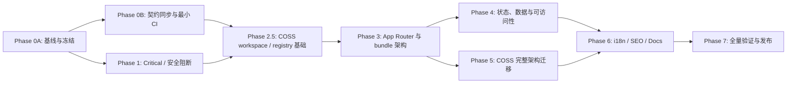

# Fugue Web 前端整体 Code Review 修复方案

> 状态：Implementation PR #1 已合并并完成首发；preauthorization follow-up 已本地验证，待 PR/CI、自动重部署与稳定观察
>
> 文档日期：2026-07-12
>
> 审查基线：`70625c7f4d18b0a4ede0767c38d5bb09696b15cd`
>
> COSS 架构基线：[`cosscom/coss`](https://github.com/cosscom/coss) `1664a7f0b3be9f25f5ff0ac846667633b4ccd6b4`（2026-07-10）
>
> 强制架构要求：完整采用 COSS 的 workspace、registry、Base UI、shared package 和工具链架构；仅做视觉模仿不算完成
>
> 适用仓库：`fugue-web`；涉及 API 契约或控制平面时同时适用 `fugue`
>
> 勾选规则：只有实现、自动化验证、人工验收和必要的发布证据全部完成后，才可把对应 TODO 从 `[ ]` 改为 `[x]`。

本文档把 2026-07-12 的整体前端 Code Review 固化成可执行的修复路线图。它不是单纯的问题摘录，而是后续拆 PR、排期、验收和发布时的执行事实源。

代码位置和行号对应上述审查基线，后续代码移动时应以符号名和行为为准。2026-07-12 用户已明确决定：Fugue Web 不再只借用 COSS 的视觉风格，而要采用 `cosscom/coss` 的完整前端架构。本决定必须在实施前同步回仓库根 `AGENTS.md`；在该文件完成同步前，不允许用旧的 Morlane-only 规则开始新的 UI 实现。

## 1. 修复目标

这轮修复的目标是把项目从“能够构建，但存在发布阻断项和系统性技术债”推进到“安全边界明确、契约同步、可测试、可发布、可持续演进”的状态。

### 1.1 必须达成的结果

- 消除空库首用户自动获得永久平台管理员权限的路径。
- 让 blocked、deleted、demoted 用户在下一次请求立即失去相应权限。
- 修复开放重定向、OAuth login CSRF、认证端点滥用和上传 OOM 风险。
- 升级有已知高危漏洞的生产依赖，并建立持续供应链门禁。
- 恢复 OpenAPI-first 契约同步，禁止前端继续基于过期 snapshot 工作。
- 把 `/app` 的访问控制移到服务端边界，而不是依赖客户端请求失败。
- 拆分超大 Client Component，恢复 Server Component 优先和按需加载。
- 以 COSS 的完整仓库架构、组件分层、registry 工作流和 Base UI 组合模型重构前端，而不只是复刻视觉。
- 补齐键盘、屏幕阅读器、焦点、表单、移动端和对比度等可访问性要求。
- 对大数据列表、异步请求、缓存失效、国际化、SEO 和静态渲染建立明确策略。
- 建立 build、contract、unit、integration、E2E、axe、style、bundle 和 dependency CI 门禁。

### 1.2 非目标

- 不借修复之名新增营销信息、统计块、说明 section 或虚构产品能力。
- 不在前端猜测后端字段、上传协议、轮询行为或错误结构。
- 不手改 `apps/web/openapi/fugue.yaml` 或 `apps/web/lib/fugue/openapi.generated.ts`。
- 不把所有页面一次性改成 Client Component，也不通过全局状态重写掩盖现有边界问题。
- 不把“采用 COSS 架构”误解为复制 Cal.com 的业务对象、营销内容、页面 IA、品牌资产或示例数据。
- 不迁移 `apps/origin/` 的旧 Radix/Origin UI 路线；COSS 当前活跃的 Base UI 架构才是目标。
- 不把当前手写的 `components/coss/*` 或 `components/fugue-coss/*` 当成已经完成 COSS 架构迁移。
- 不把临时 SSH、手工 patch Deployment、手工同步镜像当作正式发布方式。
- 不把 `fugue app env ls/show/export` 等用户主动查看配置的 CLI 默认改成脱敏；诊断输出与主动查看命令应继续遵守仓库既有产品原则。
- 不为了追求理论复杂度优化而改写冷路径；优先修复已证实的大包、无界数据和竞态问题。

## 2. 锁定的事实源与决策

### 2.1 事实源优先级

1. 本文件记录的 2026-07-12 用户架构决策；实施前必须同步到仓库根 `AGENTS.md`。
2. COSS 架构参考：[`cosscom/coss`](https://github.com/cosscom/coss) 固定提交 `1664a7f0b3be9f25f5ff0ac846667633b4ccd6b4`。
3. 后端权威契约：`/Users/yanyuming/Downloads/GitHub/fugue/openapi/openapi.yaml`。
4. 后端正式实现：`/Users/yanyuming/Downloads/GitHub/fugue`。
5. 前端迁移前正式运行时代码：`app/`、`components/`、`lib/`、`app/api/auth/*`。
6. 本文件的审查证据、阶段依赖和验收门禁。

`/Users/yanyuming/Downloads/GitHub/morlane` 降级为历史视觉参考，不再是目标架构或唯一运行时设计系统。

前端派生产物只用于消费，不是上游事实源：

- `apps/web/openapi/fugue.yaml`
- `apps/web/lib/fugue/openapi.generated.ts`

### 2.2 已锁定的 COSS 架构决策

- 目标不是“COSS 风格的单体 Next.js”，而是与上游一致的 Bun + Turborepo workspace、多应用、多 package、registry-first 架构。
- `apps/ui/registry/default/ui` 是 UI primitive 的唯一人工维护源；`packages/ui/src/components`、hooks、lib、base-ui 由同步脚本生成，不允许两边手工双写。
- 产品应用只通过内部 workspace package 的直接子路径导入，例如 `@fugue/ui/components/button`，不使用容易扩大 bundle 的总 barrel import。
- 活跃 primitive 基础统一为 Base UI；使用 `render` composition，不继续扩展 Radix `asChild` API。
- UI 组件采用 Tailwind CSS v4、semantic CSS variables、`data-slot`、CVA、`cn()` 和 component variants；页面不得用局部 CSS 重写组件颜色/typography。
- 组件通过 shadcn registry 形式发布、预览和安装；registry item 必须声明准确的 `registryDependencies`、外部 dependencies、files 和 categories。
- `apps/ui` 使用独立的 Next.js/Fumadocs 文档与 registry app，负责 primitives、particles、迁移文档、代码预览和 registry JSON 产物。
- `packages/ui` 提供 components、base-ui adapter、hooks、lib、fonts、shared patterns、global styles 和 PostCSS config 的明确 exports。
- `packages/typescript-config` 提供严格共享配置；应用和 package 不各自复制 TypeScript 基线。
- 根工具链使用 Bun、Turborepo 和 Biome；format、lint、typecheck、test、build 与 registry jobs 由 root scripts 统一编排。
- React/Next.js 仍默认 Server Component；只有 hooks、浏览器 API、交互状态或 Base UI 客户端 primitive 边界才声明 `"use client"`。
- COSS 的组件 API、密度、semantic token 和交互行为是 UI 基线；Fugue 品牌与产品语义通过 semantic variables 和应用层 composition 表达，不另建 Morlane 平行系统。
- COSS 的 `apps/origin` 是 legacy snapshot，不进入目标架构。
- 用户界面不出现 “COSS-style” 等内部实现术语，也不复制 Cal.com 内容或品牌资产。

### 2.3 已锁定的工程决策

- React/Next.js 默认 Server Component，只有交互边界才使用 Client Component。
- 权限判断必须在服务端 layout、route handler 或 server action 边界完成。
- 所有产品写接口必须验证“签名有效 + 用户仍然 active + 权限版本仍然有效”。
- API 改动先改后端 OpenAPI，再生成后端、更新实现，最后同步前端。
- 数据库变更使用 expand/migrate/contract，保证滚动发布期间前后版本可共存。
- 安全修复不能通过回滚重新开启已知不安全行为。
- 大列表优先服务端分页、筛选和稳定排序；虚拟化是渲染补充，不替代接口有界化。
- 性能优化必须保留修复前后测量，不能只凭主观感觉勾选完成。

### 2.4 许可证与来源边界

上游采用混合许可证，不能把“完全采用架构”理解为可以无差别复制整个仓库：

- 上游根目录默认是 AGPL-3.0。
- 上游 [`LICENSING.md`](https://github.com/cosscom/coss/blob/1664a7f0b3be9f25f5ff0ac846667633b4ccd6b4/LICENSING.md) 明确 `apps/ui/` 与 `apps/origin/` 为 MIT。
- 上游 `packages/ui/package.json` 自身声明 `AGPL-3.0-or-later`；在未完成许可证评审前，不直接复制、vendor 或发布该目录的源码。
- Fugue 优先从 MIT 的 `apps/ui/registry/default/*` 和官方 shadcn registry 获取允许使用的 component source，并保留许可证、copyright 和来源记录。
- 如果要直接使用 `@coss/ui` package、复制 AGPL 目录或部署其修改版本，必须先由项目所有者明确接受 AGPL 义务或取得其他授权。
- 只借鉴目录边界、生成流程、API 形态和工程模式时，也要保留一份 upstream provenance 清单，记录文件来源、commit、许可证与本地修改。

本段是工程 Gate，不替代正式法律意见。

## 3. 审查基线与已验证事实

### 3.1 已通过的检查

- `npm run build`：通过，Next.js 16.2.1 构建出 59 个静态页面。
- `npm run typecheck`：通过。
- `npm run openapi:generate:check`：针对当前过期 snapshot 通过。
- 生产代码普遍使用参数化 SQL、`server-only`、typed `openapi-fetch`、AES-256-GCM、webhook HMAC 和资源所有权过滤，这些模式应保留。
- 页面 snapshot cache 已有 TTL、stale、inflight 去重、AbortController 和 `startTransition` 等可复用思路。

### 3.2 已失败或确认异常的检查

- `npm run contract:check`：失败；前端 OpenAPI snapshot 与后端权威契约漂移。
- `npm audit --omit=dev`：1 个 High、1 个 Moderate；Next.js 16.2.1 需要升级。
- 最大应用 chunk 约 `436,412 B` raw / `129,076 B` gzip。
- 首屏 JavaScript 基线：`/` 约 198 KiB gzip，`/docs` 约 332 KiB，`/auth/sign-in` 约 332 KiB，`/app` 约 340 KiB。
- 未登录访问 `/app` 会先得到 Console HTML，再由客户端 API 返回 401。
- 注册页 Password tab 实际仍展示 Email link 流程。
- Auth 主体不是原生 `<form>`，字段缺少完整的 name/type/autocomplete/提交语义。
- 现有工作树在本文件创建前只有用户自己的 `.gitignore` 修改；后续执行不得覆盖它。

### 3.3 必须保留的正向模式

- OpenAPI 生成类型与 `openapi-fetch<paths>` 的 typed client 边界。
- 敏感服务模块的 `server-only` 隔离。
- 参数化 SQL、资源 owner/tenant 过滤和 soft-delete 条件。
- AES-256-GCM 密封、webhook 原始 body HMAC 与常量时间比较。
- SSE 的 abort 传播、reader 清理和 `no-store`。
- page snapshot cache 的 TTL、stale、inflight 去重、AbortController 和 transition 思路；修复失效竞态时不应退回重复请求。
- 独立请求的 `Promise.all`/`allSettled` 并行获取；拆组件时避免重新制造 waterfall。

## 4. 风险登记表

| ID | 级别 | 问题 | 主要证据 | 目标工作包 |
| --- | --- | --- | --- | --- |
| C-01 | Critical | 空库首个公开注册用户自动成为永久管理员，并存在并发多管理员竞态 | `lib/app-users/store.ts:345-375,599,666` | WP-01 |
| C-02 | Critical | blocked/deleted 用户的旧 Cookie 仍可调用大量写接口 | `lib/auth/session.ts:5-6`、`lib/fugue/product-route.ts:74` | WP-02 |
| H-01 | High | `returnTo` 可通过反斜杠等输入形成开放重定向 | `lib/auth/validation.ts:21` | WP-03 |
| H-02 | High | OAuth state 未绑定发起浏览器，缺少一次性消费和 PKCE | Google/GitHub start 与 callback routes | WP-03 |
| H-03 | High | 认证端点无共享限流，密码和 body 上限不足 | email/password auth routes | WP-03 |
| H-04 | High | 上传先全量 `formData()`/`arrayBuffer()`，可导致 OOM | `lib/fugue/local-upload-server.ts:212-321` | WP-04 |
| H-05 | High | Next.js 生产依赖存在已知漏洞且版本使用 `latest` | `package.json`、`package-lock.json:1008` | WP-05 |
| H-06 | High | 5,038 行 Client Component 污染 public/auth/docs/console bundle | `components/fugue-coss/interactive.tsx` | WP-08 |
| H-07 | High | `/app` 无服务端保护，权限导航和 noindex 也不完整 | `app/app/layout.tsx:3` | WP-07 |
| H-08 | High | Auth SSR、模式切换和表单语义错误 | `interactive.tsx:122,228,236` | WP-07 |
| H-09 | High | 当前单体手写 COSS-like 实现缺少上游真实的 workspace、registry、Base UI 和共享 package 架构 | `app/globals.css`、`components/coss/*`、缺失的 `apps/ui`/`packages/ui` | WP-09A/WP-09B |
| H-10 | High | Env row 使用可变业务 key 作为 React key，输入时丢焦点 | `interactive.tsx:783-785` | WP-07 |
| H-11 | High | Drawer/Dialog 缺完整焦点管理，focus ring 对比不足 | `components/coss/ui.tsx:635-725` | WP-10 |
| M-01 | Medium | 前端 OpenAPI snapshot 与后端权威契约漂移 | 两仓库 `openapi.yaml:24923` | WP-06 |
| M-02 | Medium | 缺 lint、unit、integration、E2E、axe、style、bundle、安全 CI | `package.json:7-17`、单一 workflow | WP-13 |
| M-03 | Medium | Admin users/apps 全量读取、缓存、过滤和渲染 | `lib/app-users/store.ts:299`、DataTable | WP-11 |
| M-04 | Medium | endpoint URL 改变时保留旧资源数据 | `interactive.tsx:1393,1680` | WP-11 |
| M-05 | Medium | locale 支持与 html lang、文案、日期格式不一致 | `lib/i18n/*`、`app/layout.tsx:13` | WP-12 |
| M-06 | Medium | metadata、canonical、robots、sitemap、noindex 不完整 | `app/layout.tsx:6` | WP-12 |
| M-07 | Medium | Tabs、表单、触控目标、heading、Docs 导航等系统性 a11y 问题 | `components/coss/ui.tsx`、`app/docs/page.tsx` | WP-10/WP-12 |
| M-08 | Medium | Copy 失败仍宣告成功，未复用已有安全 helper | `interactive.tsx:107`、`lib/ui/clipboard.ts:79` | WP-10 |
| M-09 | Medium | 邮件转义、认证方式并发删除、权限缓存、代理头、seal key 等硬化缺口 | `lib/auth/*`、`lib/security/*` | WP-02/WP-03/WP-05 |
| M-10 | Medium | 异步缓存失效后旧 Promise 可回填陈旧数据 | `lib/server/expiring-async-cache.ts:13,56` | WP-11 |
| M-11 | Medium | loading 时 Console shell 消失，页面切换产生结构抖动 | `app/app/layout.tsx` | WP-07 |
| M-12 | Medium | JSX 数值条件可能渲染孤立的 `0` | `interactive.tsx:1168,1176` | WP-07 |
| M-13 | Medium | ConfirmDialog 固定 destructive，却被普通 Copy 等动作使用 | `components/coss/ui.tsx:725` | WP-10 |

## 5. 目标架构

### 5.1 请求与权限边界

所有受保护请求应统一经过以下链路：

```text
signed cookie
  -> session claim validation
  -> active user lookup
  -> session/authz version comparison
  -> role/resource authorization
  -> product API or control-plane client
```

禁止 route handler 只调用 `requireSession()` 后直接使用 workspace admin key 或 `FUGUE_BOOTSTRAP_KEY`。

### 5.2 App Router 边界

```text
Server layout
  ├─ active-session guard
  ├─ locale + metadata
  ├─ stable ConsoleShell
  └─ Server page/data
       └─ small client islands
            ├─ form interaction
            ├─ dialog/tabs
            └─ lazily loaded workbench panels
```

Public、Docs 和 Auth 路由不得加载 Console workbench 代码。CopyButton、表单控件和局部交互应是独立的小型客户端入口。

### 5.3 COSS monorepo 边界

目标目录锁定为以下结构；命名使用 Fugue namespace，但职责对齐 COSS：

```text
fugue-web/
  apps/
    web/                       # 当前产品 runtime：marketing/docs/auth/new/console/admin/API
    ui/                        # UI docs + shadcn registry + particles
      registry/default/
        base-ui/
        hooks/
        lib/
        ui/                    # 唯一人工维护的 primitives
        particles/             # 可复制的组合示例，不承载业务状态
      scripts/
      content/
    examples/
      fugue-console/           # @fugue/ui 集成、视觉和交互测试场
  packages/
    ui/
      src/
        base-ui/
        components/            # 由 apps/ui registry sync 生成
        hooks/
        lib/
        styles/globals.css
        shared/
      components.json
      postcss.config.mjs
    typescript-config/
  scripts/                     # root orchestration / OpenAPI wrappers
  biome.json
  turbo.json
  package.json
  bun.lock
```

迁移后的职责边界：

- `apps/web` 承接当前正式产品 runtime，包括 marketing、product docs、auth、new、console、admin、BFF/API、OpenAPI snapshot 和 Fugue client 适配；迁移目录不能改变现有 URL 或安全边界。
- `apps/ui` 是设计系统开发和 registry 发布表面，不被产品应用当作运行时源码目录导入。
- `packages/ui` 只包含通用 UI、Base UI adapters、hooks、样式和无业务语义的 shared patterns，不包含 Fugue API、auth、billing 或 control-plane 逻辑。
- `apps/examples/fugue-console` 消费 `@fugue/ui`，用真实组合覆盖 sidebar、table、form、dialog、empty/loading/error 等产品级场景。

### 5.4 Registry 到运行时 package 的单向数据流

```text
apps/ui/registry/default/{base-ui,hooks,lib,ui}
  -> registry:validate-deps
  -> registry:build -> apps/ui/public/r/*.json
  -> ui:sync + import rewrite
  -> packages/ui/src/{base-ui,hooks,lib,components}
  -> @fugue/ui direct subpath exports
  -> apps/web + apps/examples/fugue-console
```

`packages/ui/src/components` 等同步目标视为 generated output。任何 primitive 修改都回到 registry source，运行验证和 sync 后再提交 source + generated diff。

### 5.5 URL 与部署边界

- `apps/web` 继续在同一 canonical origin 提供 `/`、`/docs`、`/auth`、`/new`、`/app` 和 `/api`，不因 monorepo 迁移扩大 Cookie、OAuth callback、CSRF 或 CORS 边界。
- `apps/ui` 使用独立开发/文档入口；是否公开部署必须单独决定，不进入产品 sitemap，也不持有 Fugue 用户 session、bootstrap key 或控制面凭据。
- `apps/examples/fugue-console` 只使用 fixture/mock 或隔离测试后端，不连接生产控制面。
- workspace 应用之间只传递明确的 public URL 配置；Auth origin、session secret、bootstrap key 等服务器 secret 不进入 `NEXT_PUBLIC_*`。
- 如果未来为 `apps/ui` 增加域名或 path routing 并涉及 Caddy、Ingress、edge 或 control-plane，必须回到 `fugue` 仓库走正式 GitHub Actions 发布链路。

### 5.6 阶段依赖



WP-06 契约同步和 WP-13A 最小 CI 应作为 R0 先合入，以便后续 PR 能区分已有漂移和新回归；安全工作包可以与 R0 并行开发，但不能在 contract gate 仍为红色时合并。Phase 1 的不同安全工作包可并行开发，但必须在同一发布门禁中全部关闭。COSS workspace skeleton、许可证清单和 UI package 可提前建立，但大规模页面迁移不应早于共享组件边界与 server authorization 稳定，否则会重复搬迁并扩大安全回归面。

## 6. 工作包总览

| 工作包 | 主题 | 优先级 | 主要依赖 |
| --- | --- | --- | --- |
| WP-00 | 基线、冻结与证据归档 | P0 | 无 |
| WP-01 | 管理员初始化与权限模型 | P0 | WP-00 |
| WP-02 | 会话撤销与服务端授权 | P0 | WP-00 |
| WP-03 | Auth、OAuth 与滥用防护 | P0 | WP-00 |
| WP-04 | 上传链路资源安全 | P0 | WP-00、必要时 WP-06 |
| WP-05 | 依赖、密钥与供应链 | P0 | WP-00 |
| WP-06 | OpenAPI 契约同步 | P0 | WP-00 |
| WP-07 | App Router、受保护 layout 与 Auth UI | P1 | WP-02、WP-03 |
| WP-09A | COSS workspace、registry 与共享 UI package 基础 | P1 | WP-05、WP-07 |
| WP-08 | Client 模块拆分与性能预算 | P1 | WP-07、WP-09A |
| WP-09B | COSS consumers、vertical slices 与旧实现清理 | P1 | WP-08、WP-09A |
| WP-10 | 可访问性与交互语义 | P1 | WP-07、WP-09B |
| WP-11 | 数据规模、缓存与异步一致性 | P1 | WP-06、WP-08 |
| WP-12 | i18n、SEO、Docs 与静态渲染 | P2 | WP-07、WP-09B、WP-10 |
| WP-13 | 测试、CI、发布与回滚 | 全程 | 所有工作包 |

### 6.1 每个 PR 的固定门禁

- [x] PR 描述关联具体工作包、风险 ID、受影响路由和验收条件。（[PR #1](https://github.com/yym68686/fugue-web/pull/1)）
- [x] PR 说明数据迁移、部署先后、兼容窗口和回滚方式。（[PR #1](https://github.com/yym68686/fugue-web/pull/1)）
- [x] package-manager cutover 前运行现有 `npm ci` 门禁；cutover 后运行 `bun install --frozen-lockfile`、Turbo typecheck/build 和 contract check。
- [x] 新逻辑有 unit、integration 或 E2E 证据，不只依赖人工点击。
- [x] 未手改 `apps/web/openapi/fugue.yaml` 或 `apps/web/lib/fugue/openapi.generated.ts`。
- [x] API 变更记录对应的 `fugue` commit/branch 和后端测试证据。
- [x] 通用 UI 复用 `@fugue/ui` registry/package；未在应用层新增第二套 primitive、散落 hard-coded token 或手工同步副本。
- [x] 未直接修改 `packages/ui` 的 generated/synced 文件而遗漏 registry source。
- [x] 引入的上游 COSS 文件有 commit、source path、license 和本地修改记录。
- [x] 未改变与工作包无关的业务语义，也未覆盖用户原有工作树变更。
- [x] 安全 PR 包含攻击路径回归测试和失败关闭行为。
- [x] 性能 PR 包含 before/after 数据；视觉 PR 包含 desktop/mobile 证据。（[PR #1](https://github.com/yym68686/fugue-web/pull/1)）

### 6.2 必须避免的执行陷阱

- 不把所有问题塞进一个名为“前端重构”的大 PR。
- 不先做视觉改版再处理 Critical 安全问题。
- 不只给 `/app` 加 middleware/layout，却遗漏 API route 的独立授权。
- 不只修改 Cookie 格式，而不检查用户当前状态和权限版本。
- 不依赖 60 秒缓存自然过期来实现封禁、删除或降权。
- 不使用单进程 `Map` 作为多实例限流、OAuth nonce 或一次性 state 的生产存储。
- 不只依赖 Content-Length，也不在 `request.formData()` 之后才检查大小。
- 不通过 `suppressHydrationWarning` 掩盖可修复的 SSR/client 分歧。
- 不用客户端虚拟列表掩盖服务端无界查询和无界 snapshot。
- 不先全局替换 CSS 再逐页修坏掉的界面；按 workspace -> registry/package -> primitive -> shell -> vertical slice 迁移。
- 不把 COSS 的目录名复制过来却继续让 app 直接维护 primitive；registry 到 package 的单向同步是强制架构。
- 不同时保留 Morlane、手写 COSS 和 `@fugue/ui` 三套运行时设计系统。
- 不为了“对齐架构”盲目安装 COSS 的全部依赖；每个依赖必须有实际职责、bundle 评估和许可证记录。
- 不把不安全旧行为保留为默认启用的 feature-flag fallback。
- 不为了“补完整”新增摘要、metric、说明块或额外页面层级。

## 7. Phase 0：基线、冻结与执行准备

### WP-00：建立可复现基线

#### 实施 TODO

- [x] 记录开始实施时 `fugue-web` 和 `fugue` 的 commit、branch 与工作树状态。
- [x] 将 COSS upstream commit 固定为 `1664a7f0b3be9f25f5ff0ac846667633b4ccd6b4`，保存 tree、README、LICENSING、package manifests 和 registry build 基线。
- [x] 新增 upstream provenance 清单，逐项记录计划引入文件的 source path、commit、license、local path 和 local modifications。
- [x] 完成 `apps/ui` MIT 与其他 AGPL 目录的许可证评审；结论未记录前不复制上游 AGPL source。
- [x] 更新根 `AGENTS.md`：用 COSS 完整架构决策取代 Morlane-only 唯一基线，并写明 registry/package 单向同步规则。
- [x] 保存当前 `npm run build`、`npm run typecheck`、`npm run contract:check` 和 `npm audit --omit=dev` 输出。
- [x] 保存 `/`、`/docs`、`/auth/sign-in`、`/auth/sign-up`、`/app` 的 route bundle 基线。
- [x] 保存 desktop/mobile 的 marketing、docs、auth、console 基线截图。
- [x] 保存 keyboard-only、axe、forced-colors 和 200% zoom 的当前问题清单。
- [ ] 按用户“全部完成后一次 push”的交付约束，将实现拆成单一责任 commits，并至少分为 implementation PR 与发布后 closeout PR；禁止只有一个不可回滚的“前端重构”提交。
- [x] 为每个 commit/PR 标注对应工作包和风险 ID，并在 PR 描述提供逐提交 rollback map。（[PR #1](https://github.com/yym68686/fugue-web/pull/1)）
- [x] 明确数据库测试环境、测试邮件 provider、OAuth 测试 app 和临时上传目录。
- [x] 冻结非必要的新功能合入，直到 C-01、C-02、H-01 至 H-05 关闭。
- [x] 确认 `.gitignore` 的现有用户修改不是本计划的一部分，不在修复提交中改写或撤销。

#### 验收 TODO

- [x] 基线证据可由另一位开发者在同一 commit 上复现。
- [x] COSS upstream commit 与许可证结论可由另一位开发者从官方仓库复核。
- [x] `AGENTS.md`、本方案和实际 migration PR 对目标架构不存在互相冲突的表述。
- [x] 每个 Critical/High 风险都映射到至少一个实现 PR 和一个自动化测试。（[PR #1 风险矩阵](https://github.com/yym68686/fugue-web/pull/1)）
- [x] 所有 TODO 均有负责人、目标交付单元和验收证据位置。

### Phase 0 出口门禁

- [x] 先完成 WP-06 当前 OpenAPI drift 的同步，使 `contract:check` 恢复为绿色。
- [x] 先完成 WP-13A 的最小 build/typecheck/contract/test CI，后续修复 PR 才允许合并。
- [x] Critical 修复可以并行开发，但不得把“基线本来就是红色”作为跳过门禁的理由。

## 8. Phase 1：Critical 与安全发布阻断项

### WP-01：移除“首用户即管理员”并建立安全初始化

#### 问题边界

`lib/app-users/store.ts` 当前通过非删除用户数量判断首用户，并直接令其成为 admin。两个并发事务可以同时读到零；首个管理员随后又不能被 block、delete 或 demote。平台 admin route 还可以使用 bootstrap key 操作全平台资源，因此这是完整的平台接管路径。

#### 目标方案

- 删除 `visibleUserCount === 0` 自动授权逻辑。
- 管理员初始化采用“部署配置的允许邮箱 + 一次性数据库状态”方案，而不是公开注册顺序。
- 在数据库中持久化 singleton bootstrap state，记录是否完成、完成时间、操作者和版本。
- 初始化事务必须使用数据库 advisory lock、行锁或 serializable transaction，保证最多一次成功。
- 允许邮箱必须经过与登录一致的规范化；普通注册即使发生在空库也只能创建普通用户。
- 初始化成功后永久关闭自动初始化路径；恢复管理员必须走独立、审计化、显式确认的 server-side 运维命令。
- 不复用可在普通 Web 请求中泄漏或传播的 token；日志、错误和审计事件不得记录 secret。

#### 实施 TODO

- [x] 上线前盘点每个现有环境的当前管理员，确认至少一个经过验证且可恢复的管理员账号。（正式控制平面只读结果见 `wp-01-production-admin-preflight.md`）
- [x] 为已有数据库显式写入/迁移 bootstrap completed 状态，不通过“用户数量”继续推断初始化状态。
- [x] 删除空库首用户自动成为 admin 的代码分支。
- [x] 设计并迁移 bootstrap state 数据表或等价 singleton 状态。
- [x] 定义部署期管理员允许邮箱配置，并在生产启动时校验格式。
- [x] 在同一事务内取得 bootstrap lock、复查状态、授权用户并写入完成记录。
- [x] 对 setup 重放返回稳定的已完成结果，不再次授予权限。
- [x] 为没有允许邮箱、邮箱不匹配、状态已完成、数据库失败设计失败关闭行为。
- [x] 为管理员恢复提供非公开、显式确认、可审计的 server-side 命令。
- [x] 复核所有使用 `FUGUE_BOOTSTRAP_KEY` 的 admin route，确认最小权限和审计事件。
- [x] 记录管理员创建、晋升、降权、封禁和删除的安全审计事件。
- [x] 更新部署配置说明，但不把实际 secret 写入仓库或文档。

#### 自动化与验收 TODO

- [x] 空库普通 email 注册不会成为管理员。
- [x] 空库普通 Google/GitHub OAuth 注册不会成为管理员。
- [x] 允许邮箱可以在一次初始化中成为管理员。
- [x] 两个并发初始化请求最多一个成功，数据库只产生一个 bootstrap admin。
- [x] setup 重放、过期配置和错误邮箱均不能获得管理员权限。
- [x] 初始化完成后，删除再创建用户也不会重新触发首用户逻辑。
- [x] 恢复命令要求显式确认并产生审计记录。
- [x] 回归测试证明普通 admin 操作不会意外获得超出既有产品范围的控制面权限。

#### 发布与回滚边界

- 数据库迁移先上线，旧代码必须能忽略新表/新列。
- 关闭首用户晋升前必须完成现有环境管理员预检；预检失败时停止发布，不能冒险造成平台锁死。
- 新代码上线后才写入完成状态。
- 不允许回滚到“首用户自动管理员”；若应用回滚，数据库状态仍必须阻止重新 bootstrap。

### WP-02：统一 active session、会话撤销和授权版本

#### 问题边界

当前 30 天 Cookie 只校验签名。静态盘点至少有 42 个写 handler 在 session-only 边界后执行 restart、env、DNS、filesystem、node key、reservation 等操作。用户被 block/delete 后，旧 Cookie 仍可继续写控制平面。

#### 目标方案

- 建立唯一的 `requireActiveSessionUser()` 服务端入口。
- 用户记录增加单调递增的 `session_version` 或等价安全版本。
- 新签发 Cookie 包含用户标识、过期时间和 session version。
- block、delete、demote、密码安全变更和管理员强制登出必须在同一事务中递增版本。
- 权限敏感读取不依赖不可立即失效的跨请求 TTL cache；如保留缓存，key 必须包含版本并支持精确失效。
- 新边界区分 401 未认证、403 已认证但无权限、404 资源不可见，并避免泄漏额外资源信息。
- 旧 Cookie 在切换发布时统一失效并要求重新登录，不为避免退出而保留不安全兼容逻辑。

#### 实施 TODO

- [x] 为 app user 增加 session/authz version，并设计向后兼容迁移。
- [x] 更新 session claim、签发、验证和清除逻辑。
- [x] 实现 `requireActiveSessionUser()`，返回经过状态和版本验证的 typed user。
- [x] 将所有产品写 handler 从 `requireSession()` 迁移到 active-user guard。
- [x] 将所有 admin handler 迁移到 active-user + current-role guard。
- [x] 为确实只需解析签名的内部路径建立显式 allow-list，并在代码中说明理由。
- [x] block、delete、demote 和强制登出时原子递增版本。
- [x] 精确失效 app-user、session-state、admin enrichment 等权限相关缓存。
- [x] 确保 demotion 后不再存在约 60 秒的权限缓存窗口。
- [x] 在 `/app` server layout、server action 和 route handler 复用同一边界。
- [x] 增加安全日志：invalid signature、stale version、blocked、deleted、role mismatch；日志只记录脱敏标识。
- [x] 增加静态检查或约束测试，禁止新增 session-only mutation handler。

#### 自动化与验收 TODO

- [x] 用户 block 后，旧 Cookie 的下一次写请求立即返回 401/403。
- [x] 用户 soft-delete 后，旧 Cookie 的下一次写请求立即失败。
- [x] admin demote 后，旧 Cookie 的下一次 admin 请求立即失败。
- [x] 被撤销 Cookie 无法修改 env、restart、DNS、filesystem、node key 或 reservation。
- [x] 多实例部署中，一个实例执行撤销后其他实例立即或通过版本检查失效。
- [x] 旧版无 session version Cookie 在切换后失败关闭并跳转重新登录。
- [x] 正常 active 用户的读写请求、刷新和登录回跳不回归。
- [x] 静态扫描结果证明所有 mutation route 已覆盖。

#### 发布与回滚边界

- 先发布 schema，再发布兼容读写版本，最后开启强制版本校验。
- 开启校验时明确通知会发生一次全员重新登录。
- 回滚应用时不得恢复 session-only 写权限；必要时保持新 guard 的 hotfix 分支。

### WP-03：开放重定向、OAuth、限流和 Auth 硬化

#### A. 统一 returnTo 校验

目标函数只能接受站内路径，并以配置的 canonical public origin 为信任源。不能依赖请求中的任意 Host 或 `X-Forwarded-*`。

##### 实施 TODO

- [x] 将所有 `returnTo`、callback、finalize 和 install redirect 收敛到一个共享校验器。
- [x] 在解析前拒绝反斜杠、控制字符、NUL、CRLF 和协议相对路径。
- [x] 使用固定 canonical origin 构造 URL，并验证解析结果 `origin` 完全一致。
- [x] 只返回规范化后的 `pathname + search + hash`，不返回用户输入原串。
- [x] 处理单次和多次 percent-encoding，避免二次解码绕过。
- [x] 对非法值使用安全默认路径，并保留可观测但脱敏的拒绝原因。

##### 验收 TODO

- [x] 表驱动测试覆盖 `/safe`、`//evil.example`、`/\\evil.example`、编码斜杠/反斜杠、CRLF、NUL、绝对 URL、混合协议和多重编码。
- [x] password、email、Google、GitHub、finalize 和 GitHub install 全部复用同一校验器。
- [x] 浏览器 E2E 证明任何非法 `returnTo` 都不会离开可信 origin。

#### B. OAuth state 浏览器绑定、一次性消费与 PKCE

##### 实施 TODO

- [x] Google 和 GitHub start route 生成高熵 nonce 与 PKCE verifier/challenge。
- [x] 将 nonce 或其安全摘要写入 HttpOnly、Secure、SameSite Cookie。
- [x] 将 provider、nonce hash、returnTo、createdAt、expiresAt 和 consumedAt 存入共享一次性状态存储。
- [x] callback 同时验证签名 state、浏览器 Cookie、provider、TTL 和未消费状态。
- [x] nonce 比较使用常量时间函数。
- [x] 在交换 authorization code 前原子消费 state，阻止并发重放。
- [x] provider token exchange 使用 PKCE verifier。
- [x] callback 成功或失败后都清理临时 Cookie 和服务端状态。
- [x] finalize/handoff token 也绑定原始浏览器或一次性会话，不能把攻击者 callback URL 转交给受害者完成登录。
- [x] 为同一浏览器多标签页并行发起 OAuth 设计独立 transaction identity，不能因覆盖单个 nonce Cookie 而串线。

##### 验收 TODO

- [x] 正常 Google 和 GitHub 登录成功。
- [x] 跨浏览器打开 callback 失败。
- [x] 同一 callback URL 重放失败。
- [x] nonce Cookie 缺失、篡改、过期或 provider 不匹配时失败。
- [x] PKCE verifier 缺失或不匹配时失败。
- [x] 两个并发 callback 最多一个成功。
- [x] 同一浏览器多标签页发起两个合法 OAuth 流程时，状态不会互相覆盖或错误绑定。
- [x] 所有失败路径清理临时状态且不创建 Fugue session。

#### C. Auth 限流、输入上限与防枚举

##### 实施 TODO

- [x] 采用多实例共享的限流存储，不使用单进程内存作为生产唯一状态。
- [x] 对 email start 使用 IP、normalized email 和全局 provider 三层预算。
- [x] 对 password sign-in 使用 IP + normalized email 组合预算和渐进退避。
- [x] 对 OAuth start/callback、finalize 和 token verify 增加合理的滥用预算。
- [x] 超限返回 429 和 `Retry-After`，客户端显示可恢复的等待状态。
- [x] 在 JSON/body 解析和 scrypt 之前限制 request body 与 password 长度。
- [x] 对 email、display name、token、returnTo 和 provider error 设置服务器端长度上限。
- [x] 登录、找回和邮件发送响应不泄漏账号是否存在。
- [x] 记录 rate-limit hit、邮件 provider failure 和高成本哈希拒绝指标，不记录密码、token 或完整邮箱。
- [x] 对合法代理链提取客户端 IP；无法确认时使用保守的共享 key，而不是信任任意 forwarded header。
- [x] 明确限流/nonce 存储不可用时的策略：密码、邮件发送和 OAuth state 验证失败关闭并返回可恢复的 503/429，不静默降级为无限制或跳过 state 验证。

##### 验收 TODO

- [x] 超出预算稳定返回 429 和正确 `Retry-After`。
- [x] 超长 password/body 在进入 scrypt 或邮件发送前被拒绝。
- [x] 多实例下限流结果一致。
- [x] 不存在基于状态码、正文或显著时序差异的直接账号枚举。
- [x] 客户端正确展示等待、重试和网络失败状态。

#### D. 其他 Auth 并发与内容安全

##### 实施 TODO

- [x] HTML 邮件的 display name 和所有动态文本统一做 HTML text/attribute escaping。
- [x] 邮件同时提供独立纯文本版本，HTML 与 text 不共享未转义字符串模板。
- [x] 删除认证方式时按用户加 advisory lock，或锁定该用户全部 auth-method 行。
- [x] 在同一事务内复查“至少保留一种认证方式”不变量。
- [x] 对并发删除两个不同认证方式编写数据库测试。
- [x] 生产 Auth origin 使用 canonical public origin 配置。
- [x] 明确可信代理数量/网段，入口代理覆盖而非透传客户端 `X-Forwarded-*`。
- [x] 生产 Cookie 永远设置 Secure；开发环境使用显式环境分支。

##### 验收 TODO

- [x] ``、`<a>`、事件属性、控制字符和 emoji 在邮件中只作为文本呈现。
- [x] 两次并发删除认证方式最多一次成功，账号始终可登录。
- [x] 伪造 forwarded host/proto 无法改变邮件 URL、OAuth origin 或 Cookie 安全属性。

### WP-04：上传链路流式化与资源上限

#### 目标方案

- Content-Length 只作为快速拒绝，不作为唯一防线。
- 使用支持 backpressure 的流式 multipart parser，把内容写入权限受限的 request-scoped 临时目录。
- 从后端 OpenAPI 和正式实现读取真实协议限制，并在前端只采用不高于上游的上限。
- 同时限制 request 总字节、单文件字节、文件数、路径数、路径长度、未压缩总量、压缩总量和并发归档数。
- 对路径穿越、绝对路径、NUL、符号链接、重复路径和压缩炸弹失败关闭。
- 通过流式 tar/gzip 或后端正式支持的协议上传，不保留 `arrayBuffer[] + Buffer.concat` 多份内存副本。

#### 实施 TODO

- [x] 核对后端 OpenAPI 和上传 handler 的真实 content-type、最大值和错误响应。
- [x] 如果协议需要变化，先在 `fugue/openapi/openapi.yaml` 修改并完成后端 generate/test。
- [x] 在读取 body 前对缺失或超限 Content-Length 做策略处理。
- [x] 用流式 parser 替换 `request.formData()` 全量缓冲。
- [x] 为每个请求创建唯一、权限受限的临时目录。
- [x] 流式写入时持续统计总字节和单文件字节，超限立即 abort。
- [x] 限制文件数量、字段数量、路径长度和嵌套深度。
- [x] 拒绝 `..`、绝对路径、反斜杠歧义、NUL、符号链接和设备文件。
- [x] 用流式归档与上传替换 `arrayBuffer()`、chunk 数组和 `Buffer.concat`。
- [x] 限制并发压缩任务，避免多个合法大上传同时耗尽 CPU/内存。
- [x] 在应用入口和可信反向代理分别配置请求体上限、上传超时和并发限制；两层配置保持一致且以更严格者为准。
- [x] 如需修改 Caddy、Ingress、edge 或 control-plane 配置，只通过 `fugue` 仓库正式发布链路实施。
- [x] client abort、上游失败、parser error 和超限时统一清理临时文件。
- [x] 返回稳定的 400/413/415/429/500 错误模型，并在 UI 中提供可恢复提示。
- [x] 增加上传耗时、大小、拒绝原因、峰值 RSS 和临时文件清理指标。

#### 自动化与验收 TODO

- [x] 正常小型 repository/files 上传成功且内容不变。
- [x] chunked transfer 在没有 Content-Length 时仍受流式计数保护。
- [x] 超总量、超单文件、超文件数和超路径长度均在有界内存内失败。
- [x] 路径穿越、符号链接、重复路径和压缩炸弹样本失败关闭。
- [x] 上传中断、上游超时和 parser 异常后临时目录为空。
- [x] 并发大上传不会使进程 RSS 无界增长或阻塞健康检查。
- [x] 压测报告记录峰值内存、吞吐和拒绝行为。

#### 发布与回滚边界

- 新旧协议如有差异，先发布后端兼容能力和权威 OpenAPI，再切前端。
- 回滚不得恢复无上限全量缓冲；至少保留入口拒绝和并发限制。

### WP-05：生产依赖、密钥与供应链

#### 实施 TODO

- [x] 将 Next.js 从 16.2.1 升级到已修复版本，最低不低于审查时可用的 16.2.10。
- [x] 核对并同步兼容的 React、React DOM、TypeScript 与 Next 构建链版本。
- [x] 把 `"latest"` 改为明确版本或受控 patch/minor 范围。
- [x] 更新 lockfile，并确认 clean install 可复现。
- [x] 运行生产依赖 audit，逐项记录无法立即修复的风险与豁免截止日。
- [x] 在 CI 阻止新增 Critical/High 生产漏洞。
- [x] 增加定期依赖更新任务，但不自动合并未经 build/E2E 验证的升级。
- [x] 生产启动时要求独立、显式、满足长度要求的 session secret 与 seal key。
- [x] 删除 seal key 对 OAuth、邮件凭据或其他会轮换 secret 的隐式回退。
- [x] 密文包含 key id/version，并实现旧 keyring 读取和后台重加密路径。
- [x] Compose 和部署模板对必填 secret 使用 fail-closed 校验，不接受空字符串。
- [x] 确认日志、错误和诊断包不会输出实际 secret。

#### 自动化与验收 TODO

- [x] `npm audit --omit=dev` 不存在 Critical/High。
- [x] clean install、typecheck、build 和核心 E2E 全部通过。
- [x] 缺失或弱 session/seal key 时生产启动失败并给出不含 secret 的错误。
- [x] key rotation 演练证明旧密文可读、新写入使用新 key、迁移后可移除旧 key。
- [x] lockfile diff 经过人工审查，不包含意外依赖源或安装脚本。

## 9. Phase 2：契约与质量门禁

### WP-06：恢复 OpenAPI-first

#### 当前漂移

后端权威 `PlatformArtifactVerificationEvidence` 已增加六个 `*_state` 字段，并把旧 boolean 标为 deprecated/optional；前端 snapshot 和生成类型仍保留旧结构。`openapi:generate:check` 对过期 snapshot 自洽，但 `contract:check` 会在 sync check 阶段失败。

#### 实施 TODO

- [x] 在 `fugue` 仓库确认权威 OpenAPI 和后端实现一致。
- [x] 对当前已有契约变更运行后端 `make generate-openapi` 和 `make test`。
- [x] 回到 `fugue-web` 运行 `npm run openapi:sync`。
- [x] 运行 `npm run openapi:generate`，不手改生成 diff。
- [x] 搜索旧 boolean 和新 `*_state` 字段的所有前端消费者。
- [x] 更新 view model 的薄适配；不重新引入 `unknown + sanitize*` 大型手写解析器。
- [x] 为 deprecated 字段写清退出条件，不长期保留猜测性双协议兼容。
- [x] 对上传、日志流、轮询、分页、下载和错误响应逐一核对契约与正式实现。
- [x] 为后续 admin pagination 等 API 变更先提交后端契约 PR，再实施 handler 和前端。

#### 验收 TODO

- [x] `npm run openapi:sync:check` 通过。
- [x] `npm run openapi:generate:check` 通过。
- [x] `npm run contract:check` 通过。
- [x] `npm run typecheck` 通过。
- [x] Bun/Turbo cutover 后，root `bun run openapi:*`、`bun run contract:check` 与 `bun run typecheck` wrapper 保持上述行为和退出码。
- [x] 前端 snapshot 与后端权威文件在同步规则范围内完全一致。
- [x] 生成文件没有手工编辑痕迹。

### WP-13A：先建立最小 CI 门禁

WP-13A 分两层执行：R0 先建立 build、typecheck、contract、dependency audit 和 test harness；各工作包再把 unit、DB、E2E、axe、style 和 bundle 用例逐步补成 required checks。不能为了等待完整视觉 CI 而延迟 Critical 安全补丁，但安全补丁自身的攻击路径测试必须随补丁合入。

#### 实施 TODO

- [x] 采用根 `biome.json` 和 package-level `lint` scripts，不再新建一套平行 ESLint 规则。
- [x] 固定 Bun 版本并提交 `bun.lock`；CI 使用 `bun install --frozen-lockfile`。
- [x] 新增 `turbo.json`，让 build、lint、typecheck、test、registry build 的 dependency graph 与 cache inputs/outputs 可验证。
- [x] 新增 `packages/typescript-config`，至少提供 base、Next.js 与 React library 配置。
- [x] 新增 Bun unit test runner 与 `test:unit`；如个别工具必须用其他 runner，统一由 root script 编排。
- [x] 新增 PostgreSQL-backed integration test 与 `test:integration`。
- [x] 新增 Playwright 与 `test:e2e`。
- [x] 新增 axe 集成与 `test:a11y`。
- [x] 为 `test/style-audit/contracts/*.json` 和 route inventory 实现真实 runner。
- [x] 新增 bundle manifest/budget 检查脚本。
- [x] 新增 production dependency audit 脚本。
- [x] 新增 workspace version/duplicate check，阻止 Next、React、Base UI、Tailwind 和 TypeScript 出现未经批准的多版本。
- [x] 新增 license/SBOM check，验证 COSS provenance allow-list、NOTICE 和第三方许可证。
- [x] CI 增加 format、lint、typecheck、contract、unit、integration、E2E、axe、style、bundle、registry validate/build/sync-check、audit 和 Turbo build jobs。
- [x] registry sync-check 在 CI 重新生成到临时输出并比较，证明 `apps/ui` source 与 `packages/ui` synced output 无漂移。
- [x] 对安全并发测试提供隔离数据库和可重复 seed/cleanup。
- [x] 上传测试限制自身资源，避免 CI runner 被测试样本拖垮。
- [x] 将 Critical/High 对应测试设为 required checks。（`main` strict branch protection，17 个 GitHub Actions contexts，`app_id=15368`）

#### 验收 TODO

- [x] 新 clone 在文档化命令下可运行全部门禁。（`4f1aba0`，全新 `--no-local` clone，25 项门禁 482 秒完成）
- [x] `bun run build`、`bun run lint`、`bun run typecheck` 和 `bun run test` 可从根目录执行并覆盖所有 workspace。
- [x] Turbo filter 能单独验证 `apps/web`、`apps/ui`、example 和 `packages/ui`。
- [x] 任意一个已知漏洞的回归用例失败都会阻止 PR 合并。
- [x] style-audit JSON 不再只是无人执行的静态清单。
- [x] CI 报告包含可下载的 Playwright、axe、bundle 和截图证据。

## 10. Phase 3：App Router、Auth UI 与客户端架构

### WP-07：服务端受保护 layout 和稳定 shell

#### 实施 TODO

- [x] 将 `/app` active-session guard 放入 server layout，在返回产品 HTML 前完成。
- [x] 通过共享 safe-returnTo helper 保存登录回跳。
- [x] server layout 根据当前权限生成导航，普通用户不接收 admin nav 数据。
- [x] Console sidebar、topbar 和 page frame 移入稳定 layout。
- [x] loading、error、not-found 和空状态只替换 workspace，不卸载 shell。
- [x] Auth 和 Console 路由输出 `noindex, nofollow` metadata。
- [x] root/public 页面不得因 Console session CTA 被无意整体动态化。
- [x] 将个性化 CTA 隔离成小边界，或使用不依赖 session 的静态 CTA。
- [x] 明确 `/app`、`/new`、admin 页和 auth finalize 的未登录/无权限行为。

#### Auth UI TODO

- [x] 由 server page 读取、校验并把 `returnTo` 作为 prop 传入客户端表单。
- [x] 删除 render 阶段对 `window` 的读取，消除 SSR/hydration 分歧。
- [x] 把 sign-in/sign-up 与 email/password/provider 模式建模为明确状态，而不是复用错误 tab 内容。
- [x] 使用真实 `<form>` 和 `onSubmit`。
- [x] email 使用 `type="email"`、稳定 `name` 和正确 autocomplete。
- [x] password 使用正确 autocomplete，并按登录/注册区分 current/new password。
- [x] label、hint、error 通过 id 和 `aria-describedby` 关联。
- [x] Enter 提交、提交中禁用、防双击、错误后保留输入并恢复焦点。
- [x] provider、邮件发送、密码、callback、过期、限流和网络失败都有明确状态。

#### UI 正确性 TODO

- [x] Env 草稿行使用生成一次后不变的 UUID 作为 React key。
- [x] 业务字段 `row.key` 只表示环境变量名，不再决定组件 identity。
- [x] 修复所有 `count && <Component>` 可能渲染 `0` 的条件表达式。
- [x] 检查列表增删、重排、validation error 后的焦点和 selection 保持。

#### 验收 TODO

- [x] 未登录请求 `/app` 在产品 HTML 返回前跳转登录。
- [x] blocked/deleted 用户不能渲染 `/app` shell。
- [x] 普通用户 HTML/Flight payload 中不包含 admin 导航项。
- [x] 登录成功后只回到经过校验的站内路径。
- [x] SSR 与 hydration 没有 returnTo 或 mode mismatch。
- [x] sign-up Password tab 展示并提交正确注册流程。
- [x] 浏览器密码管理器可以识别并填充字段。
- [x] Console 路由切换时 sidebar/topbar 不闪烁、不消失、无明显 CLS。
- [x] Env 连续输入首字符和后续字符都不丢焦点。
- [x] 空计数不会在界面上出现孤立的 `0`。

### WP-08：拆分 5,038 行 Client Component

#### 目标目录边界

Client mega module 的拆分必须直接落到目标 workspace 边界，而不是先在仓库根制造一套临时目录：

```text
apps/web/components/
  auth/                       # Fugue auth composition
  marketing/                  # product-specific composition
  docs/                       # product docs composition
  console/
  projects/
    environment/
    domains/
    files/
    observability/
    runtime/
  billing/
  admin/
packages/ui/src/components/  # synced generic COSS primitives only
packages/ui/src/shared/      # cross-app, non-business compositions only
```

共享行为放在小型 hook 或 provider 中；provider 暴露 state/actions/meta 接口，不让所有消费者知道内部 fetch/cache 实现。避免用不断增加 boolean props 的单体组件承载所有页面模式。Auth、billing、Fugue API、admin 权限和 control-plane 对象永远不下沉到 `packages/ui`。

#### 实施 TODO

- [x] 生成 `interactive.tsx` 的导出、调用方、状态和副作用清单。
- [x] 先提取无副作用的 pure utility 和 type，不改变行为。
- [x] 把 CopyButton 独立成最小客户端岛，Docs 不再导入整个 workbench。
- [x] 把 Auth 表单、marketing CTA、gallery、workbench、billing、admin 分成独立入口。
- [x] Server Component 可完成的数据获取、格式化和静态结构移回服务端。
- [x] 只把交互所需最小可序列化 props 传给 Client Component。
- [x] 文件、日志、环境变量、domains 等不活跃 workbench panel 使用动态 import。
- [x] hover/focus 时可预加载高概率下一 panel，但不在首屏无条件加载。
- [x] 把跨组件共享状态提升到按域 provider，避免全应用 giant provider。
- [x] 用显式 variant/compound component 替代容易膨胀的 boolean prop 组合。
- [x] 删除拆分后孤立的手写 `components/coss`/`components/fugue-coss` wrapper、重复 type 和不可达分支；通用能力改由 `@fugue/ui` 提供。
- [x] 产品域组件直接导入 `@fugue/ui/components/*`，不从 `apps/ui/registry` 或 `packages/ui` 内部相对路径导入。
- [x] 确认拆分没有把 server-only 模块带进客户端 bundle。

#### 性能预算 TODO

- [x] Public/Auth/Docs 路由不得加载 Console workbench 模块。
- [x] `/`、`/docs`、`/auth/sign-in`、`/auth/sign-up` 的初始 JS 目标不高于 200 KiB gzip。
- [x] Console shell 的 route-common 初始 JS 目标不高于 250 KiB gzip，panel 代码按需加载。
- [x] 除框架/vendor 外，单个 app-owned initial chunk 目标不高于 80 KiB gzip。
- [x] CI 比较 route bundle manifest，超过预算或较基线增长 10% 时失败。
- [x] 在真实低端设备/CPU throttle 下测量 INP、long task 和 panel 切换。

#### 验收 TODO

- [x] `/docs` 和 `/auth/*` 不再加载约 129 KiB gzip 的工作台大 chunk。
- [x] `interactive.tsx` 被删除或只保留短期、明确到期的兼容 re-export。
- [x] bundle analyzer/manifest 证据随 PR 归档。
- [x] `/`、Docs、Auth、Console 核心 E2E 行为不回归。
- [x] 没有新增 hydration warning、重复请求或客户端 waterfall。

## 11. Phase 4：数据规模、状态韧性与可访问性

### WP-11：有界数据、请求 identity 与缓存一致性

#### A. Admin users/apps 分页

- [x] 在后端权威 OpenAPI 设计 cursor、limit、filter 和稳定 sort 字段。
- [x] 后端查询保留 tenant、权限、soft-delete 和稳定 tie-breaker。
- [x] 为过滤/排序字段增加必要索引，并检查实际 query plan。
- [x] 前端只缓存当前页和必要汇总，不保存无界全量 snapshot。
- [x] 搜索/过滤在服务端完成，输入使用可取消 debounce。
- [x] DataTable 只渲染当前有界页；数据仍较大时再引入虚拟化。
- [x] 处理空页、游标过期、筛选后无结果、权限变化和删除当前行。

验收：

- [x] 10k+ 模拟用户/应用时，单请求返回量、内存和 DOM 行数保持有界。
- [x] 前后翻页无重复、遗漏或不稳定跳动。
- [x] 权限和 soft-delete 过滤不会因批量查询被绕过。
- [x] 契约、handler、前端和 contract CI 全链路通过。（[frontend-quality run 29216177426](https://github.com/yym68686/fugue-web/actions/runs/29216177426)）

#### B. endpoint keyed state

- [x] `useEndpointData` 以 endpoint/resource id 作为状态 identity。
- [x] URL 改变时立即清空旧数据或进入明确 stale/loading，不显示上一资源为当前资源。
- [x] abort 旧请求，并用 generation/token 拒绝乱序响应回填。
- [x] 将 errors、retry 和 last-updated 也按 resource key 隔离。

验收：

- [x] A service 快速切换到 B 时从不显示 A 的 domains。
- [x] A 的慢响应晚于 B 返回时不能覆盖 B。
- [x] retry、404、403 和 network error 不污染其他资源状态。

#### C. ExpiringAsyncCache invalidation race

- [x] 为每个 cache key 增加 generation/version，或在 invalidate 时 abort inflight loader。
- [x] loader 完成时仅在 generation 未变化时写入 cache。
- [x] clear-all 与 clear-key 均使旧 inflight 结果失效。
- [x] 复核 billing 和其他消费者的 stale window、权限边界和手动失效时机。

验收：

- [x] 使用可控 deferred Promise 证明 invalidate 后旧结果不会复活。
- [x] 新 loader 结果不会被更早的旧 loader 覆盖。
- [x] billing update 后读取不到最长 5 分钟的旧快照。

#### D. 复杂度原则

- [x] 保留当前没有生产 O(n²) 热点的结论，不做无依据的 Map/memo 全量改写。
- [x] 对重复 lookup、render derivation 或 N+1 只在数据量和测量证明有价值时优化。
- [x] 所有优化记录 before/after complexity、行为等价理由和测量。
- [x] 确认排序稳定性、重复 key、引用 identity、缓存失效和授权过滤未被改变。

### WP-10：可访问性与交互语义

#### Dialog、Drawer 与 Confirm

- [x] 迁移到 `@fugue/ui` 中基于 Base UI 的 COSS Dialog、Sheet、Drawer 和 AlertDialog，不再维护手写 overlay primitive。
- [x] 触发器与关闭控件使用 Base UI `render` composition；迁移掉 Radix `asChild` 和嵌套 button。
- [x] 每个 Dialog、Sheet、Drawer 都有对应 Title；仅视觉隐藏时保留可访问标题。
- [x] 打开后把焦点放到合适标题、首个字段或安全默认动作。
- [x] 使用 focus trap，背景内容 inert，防止读屏和键盘穿透。
- [x] 支持 Escape、显式关闭按钮、overlay 策略和滚动锁。
- [x] 关闭后恢复到触发控件；触发控件消失时恢复到合理邻近位置。
- [x] 用 `useId` 关联 dialog title、description 和 errors。
- [x] ConfirmDialog 增加 `default` 与 `danger` 明确 variant。
- [x] 只有不可逆动作使用 danger；Copy 等普通动作不使用破坏性确认。

#### Tabs 与键盘

- [x] 使用 `@fugue/ui/components/tabs` 的 Base UI 语义作为唯一 Tabs primitive，不在应用层重写 tablist 状态机。
- [x] 验证 Tabs 输出 `tablist`、`tab`、`tabpanel`、`aria-controls` 和 `aria-labelledby`。
- [x] 采用 roving tabindex，仅 active tab 进入普通 Tab 顺序。
- [x] 支持左右方向键、Home、End；需要时明确 manual/automatic activation。
- [x] 不在普通 button 上误用 `aria-selected`。
- [x] panel 切换后保持合理焦点，不把用户跳到页面顶部。

#### 表单、反馈与复制

- [x] 表单统一使用 COSS `Form`、`Field`、`FieldLabel`、`FieldError`、`InputGroup` 等组合，不再用任意 div 模拟 field 结构。
- [x] Field 失败态同时设置 `data-invalid` 和 control `aria-invalid`；disabled 同时设置 field data state 与原生 disabled。
- [x] 为 env、server search、DNS 等所有输入补可见 label 或等价 accessible name。
- [x] error 与字段通过 `aria-invalid`、`aria-describedby` 关联。
- [x] 动态成功/失败使用克制的 live region，避免重复朗读。
- [x] 将现有可靠 clipboard 行为适配到 `@fugue/ui/hooks/use-copy-to-clipboard`，所有 Copy 入口复用同一 hook/helper。
- [x] clipboard reject、权限拒绝或非安全上下文时只宣告失败，不显示成功。
- [x] loading button 保留尺寸与 label 语义，防止重复提交。
- [x] skeleton 使用适当 busy/status 语义，并提供失败后的 retry。

#### 视觉与响应式 a11y

- [x] 恢复至少 2px 的可见 focus outline，不用低对比 shadow 取代 outline。
- [x] focus、文本、badge 和状态色满足 WCAG 2.2 AA 对比要求。
- [x] forced-colors 模式使用系统颜色和可见边界。
- [x] 主要触控目标达到 44x44 CSS px；密集表格例外必须有等价易点击入口。
- [x] 移动端输入字号至少 16px，避免 iOS 自动缩放。
- [x] 200% zoom、320/390px 宽度下无功能丢失和不可控横向滚动。
- [x] `prefers-reduced-motion` 下移除非必要动效。

#### 文档语义

- [x] 每页一个清晰 H1，后续 heading 不跳级。
- [x] CardTitle 不再硬编码 h3；使用 COSS/Base UI 的 `render` composition 或由上下文显式选择语义层级。
- [x] 添加 skip link、main landmark、nav label 和 `aria-current`。
- [x] 收敛 Docs 重复导航，避免桌面/移动端同时向读屏暴露三套相同链接。

#### 验收 TODO

- [x] Dialog 打开时键盘不能逃出，Escape 可关闭，关闭后焦点恢复。
- [x] Tabs 可完全通过 Tab、方向键、Home、End 操作。
- [x] axe 在关键路由无 Critical/Serious 问题。
- [x] keyboard-only 可完成登录、创建、env 编辑、复制、确认和关闭 dialog。
- [x] forced-colors、reduced-motion、200% zoom 和移动端验收通过。
- [x] 模拟 clipboard reject 时只显示可理解的失败反馈。

## 12. Phase 5：采用 COSS 完整前端架构

### WP-09A / WP-09B：Workspace、registry、共享 UI package 与应用迁移

WP-09A 覆盖 12.1–12.8，必须在 WP-08 开始移动 consumer 之前完成；WP-09B 覆盖 12.9–12.12，在目标边界中完成产品迁移和旧实现清理。

#### 12.1 上游快照事实

固定提交 `1664a7f` 的活跃架构具有以下特征：

- Bun `1.3.1` workspaces + Turborepo + Biome。
- `apps/ui` 是 MIT 的 Next.js/Fumadocs 文档和 shadcn registry 源。
- `apps/ui/registry/default/{ui,hooks,lib,base-ui}` 是可编辑 source of truth。
- `ui:sync` 把 registry primitive 复制并改写 imports 到运行时 UI package。
- registry build 生成 `registry/__index__.tsx`、`registry.json` 与 `public/r/*.json`。
- 活跃组件基于 Base UI，不是 `apps/origin` 的 Radix 路线。
- 快照约有 54 个 primitive、496 个 particles、564 个 registry items；这些数量只用于核对架构规模，不要求 Fugue 把全部 demo 装入产品 bundle。
- `packages/ui` 以未预编译 TS/TSX source + subpath exports 供 Next app 消费，app 通过 `transpilePackages` 编译。
- 54 个 primitive 中 47 个带 `"use client"`、7 个没有 directive；496 个 particles 中 181 个是 client、315 个可保持 server-safe。这不意味着应用 layout/page 应被整体客户端化。

| 依赖/工具 | COSS `1664a7f` 快照 | Fugue 采用策略 |
| --- | --- | --- |
| Bun | 1.3.1 | 固定并验证兼容版本，作为 package/workspace/task 工具 |
| Turborepo | 2.6.1 range | 采用 task graph/caching 架构，版本由 lockfile 固定 |
| Biome | 2.3.10 | 采用 format/lint 工具链，但重新启用/评审安全与 a11y 规则 |
| Next.js | 16.2.5 | 不得降级；保持 Fugue 已确认的 16.2.10+ 安全下限或更高已验证版本 |
| React / React DOM | 19.2.6 | 全 workspace 单一兼容版本 |
| TypeScript | 5.9.3 | 全 workspace 单一 strict 版本 |
| Tailwind CSS | 4.1.17 | 采用 v4、`@theme inline`、`@source` 与 shared PostCSS 架构 |
| Base UI | 1.6.0 | 由 `@fugue/ui` 集中依赖；应用不重复直连 |
| shadcn | 4.1 range | 用于 registry schema/build/CLI dry-run，不作为运行时 UI 黑盒 |

#### 12.2 迁移顺序

1. 先完成许可证、upstream provenance 和 `AGENTS.md` 架构决策。
2. 建立 Bun/Turbo/Biome workspace skeleton，不移动业务行为。
3. 建立 `apps/ui` registry source 与 `packages/ui` 单向同步链路。
4. 导入并验证 Base UI primitives、semantic theme、fonts 和 package exports。
5. 把现有产品 runtime 原样移动到 `apps/web`，保持 URL、auth、OpenAPI 和部署行为。
6. 按 primitive -> product composition -> shell -> route vertical slice 迁移消费者。
7. 建立 upstream 更新、registry drift、E2E、axe、visual 和 bundle 门禁。
8. 最后删除 root 单体兼容路径、手写 COSS wrappers、Morlane 和旧 Fugue CSS。

#### 12.3 架构与许可证 Gate TODO

- [x] 在根 `AGENTS.md` 中写入“采用 COSS 完整架构”的 accepted decision，删除 Morlane-only 冲突条款。
- [x] 新增架构 ADR，记录为什么采用 COSS、固定 upstream SHA、目标 workspace、非目标和回滚策略。
- [x] 新增 `docs/upstream/coss.md` 或等价 manifest，记录 repo、SHA、允许同步路径、许可证与本地 deviations。
- [x] 明确只从核验为 MIT 的 `apps/ui` 路径选择性迁移 source，并保留 MIT notice/provenance。
- [x] 将上游根目录、`packages/ui`、`packages/typescript-config`、root configs、workflows、shared marketing、品牌资产和字体按 AGPL/未明确许可处理，不直接复制。
- [x] 对 Base UI、Tailwind、shadcn、Fumadocs、icons、CVA、tailwind-merge 等第三方依赖生成 SBOM/license 清单。
- [x] 项目所有者确认许可证策略；owner 明确批准可使用全部 COSS 代码，当前 release 仍保持已审计的 MIT-only 实际产物。（[`wp-09-owner-license-approval.md`](./remediation-evidence/wp-09-owner-license-approval.md)）
- [x] 不复制 CalSans、PaperMono、Cal.com/COSS logo、marketing shell、示例数据或其他品牌资产。

#### 12.4 Bun/Turborepo workspace TODO

- [x] 固定项目支持的 Bun 版本并在 root `packageManager` 声明。
- [x] 锁定第一阶段边界：Bun 作为 package manager、workspace 与 task runner；Next production runtime 先保持当前已验证的 Node 部署，切换 Bun runtime 需要独立兼容性和性能验收。
- [x] 创建 root Bun workspaces：`apps/*`、`apps/examples/*`、`packages/*`。
- [x] 创建 `turbo.json`，定义 build、dev、lint、typecheck、test、clean 与 registry tasks 的依赖和 outputs。
- [x] 创建独立的 root `biome.json`；借鉴规则结构但不复制未获许可的上游配置文本。
- [x] 创建本地 `packages/typescript-config`，提供 strict base、Next.js 和 React library configs。
- [x] 开启或分阶段开启 `noUncheckedIndexedAccess`，处理迁移暴露的真实类型错误。
- [x] root scripts 统一代理 format、lint、typecheck、test、build、OpenAPI、contract、registry、E2E、axe、bundle 与 audit。
- [x] 生成并提交 `bun.lock`，验证 `bun install --frozen-lockfile`。
- [x] Bun cutover 本地门禁稳定后，以独立 toolchain commit 删除 `package-lock.json`；因用户要求完整实现后一次 push，可与业务 commits 同属 implementation PR，但不得混在同一 commit。（独立 commit：`12d0b16`）
- [x] 为 workspace package 设置明确 name、private/license、dependencies、peerDependencies 和 exports。
- [x] 支持 `bun run build --filter=<workspace>` 或等价 Turbo filter 的独立 app/package 验证。

#### 12.5 `apps/ui` registry 与文档 TODO

- [x] 创建 `apps/ui` Next.js App Router + Fumadocs MDX 文档应用。
- [x] 在隔离分支/临时目录用 `bunx --bun shadcn@latest add @coss/ui @coss/style --dry-run` 和 `--diff` 核对官方 registry 产物；不直接 `--overwrite` 现有产品组件。
- [x] 创建 `apps/ui/registry/default/base-ui`，只放集中管理的 Base UI adapters/re-exports。
- [x] 创建 `apps/ui/registry/default/hooks`。
- [x] 创建 `apps/ui/registry/default/lib`。
- [x] 创建 `apps/ui/registry/default/ui`，作为唯一人工维护 primitive source。
- [x] 创建 `apps/ui/registry/default/particles`，只放可复制的无业务机密组合示例。
- [x] registry namespace 使用 `@fugue/*`，不冒用 `@coss/*` 发布身份。
- [x] registry metadata 使用 typed categories，并准确列出 `registryDependencies`、dependencies、files 和 type。
- [x] registry index 聚合 UI、particles、styles、approved fonts、hooks、lib 与 base-ui items；每类都有明确 license/provenance。
- [x] 实现 `registry:validate-deps`，校验实际 imports 与声明依赖一致。
- [x] 实现 `registry:build`，生成 index、registry JSON 和单 item `public/r/*.json`。
- [x] 生成文件包含明显的 do-not-edit 标记，且不作为人工真源。
- [x] docs preview 从生成 Index 按需 lazy-load particle，不把所有示例打入首屏。
- [x] 为 primitives、particles、Base UI migration、styling、tokens 和 accessibility 写可搜索文档。
- [x] 为 Fugue 的 auth form、console shell、resource table、environment editor 等沉淀不含真实凭据的 Fugue-specific particles/recipes。
- [x] 如提供 `/api/raw`、llms.txt 或 Copy Markdown，必须过滤 secret、内部路径和非公开产品数据。
- [x] `apps/ui` 的 robots/noindex、部署可见性和访问策略单独定义。

#### 12.6 Registry 到 `packages/ui` 同步 TODO

- [x] 创建 `packages/ui`，内部 package name 使用 `@fugue/ui`。
- [x] 实现 `ui:sync`，从 registry 的 base-ui/hooks/lib/ui 单向复制到 package 对应目录。
- [x] sync 时把 `@/registry/default/ui/*`、hooks、lib、base-ui imports 改写为 `@fugue/ui/*` subpaths。
- [x] `packages/ui/src/components`、hooks、lib、base-ui generated targets 不接受直接修改。
- [x] sync 不静默保留已经从 source 删除的 orphan 文件；在安全的临时输出中进行完整集合比较。
- [x] CI 运行 sync 后用 `git diff --exit-code` 或等价方式阻止 source/package drift。
- [x] `packages/ui/package.json` 提供 `./components/*`、`./base-ui/*`、`./hooks/*`、`./lib/*`、`./shared/*`、`./globals.css` 和 `./postcss.config` exports。
- [x] `@base-ui/react` 只由 `@fugue/ui` 集中依赖；应用通过 `@fugue/ui/base-ui/*` 使用允许的 adapter，不重复锁多个版本。
- [x] `packages/ui` 保持无 Fugue auth、API、billing、tenant、database 和 control-plane 依赖。
- [x] package tests 至少覆盖 Button、Dialog、Tabs、Form/Field、InputGroup、Table、Sidebar、Toast 和 sync/import rewrite。
- [x] 对 package source consumption 配置 Next `transpilePackages: ["@fugue/ui"]`。

#### 12.7 Base UI 与组件 API TODO

- [x] 以当前安全兼容版本的 `@base-ui/react` 为唯一 primitive 基础；参考提交使用 1.6.0，但实施时不得为了照抄而降级安全版本。
- [x] 将 Radix `asChild` 迁移为 Base UI `render`，避免嵌套交互元素。
- [x] 采用 Popup/Panel 等 COSS 当前命名，legacy Content alias 仅用于限时迁移。
- [x] 每个 component part 输出稳定 `data-slot`，供 composition、测试和样式定位。
- [x] variants 使用 CVA 或等价 typed variant contract，不用 boolean prop 爆炸。
- [x] item 必须处于对应 group 内；Dialog/Sheet/Drawer 必须有 Title；Avatar 必须有 fallback。
- [x] Form 使用 Form + Field/FieldGroup；InputGroup 只包含规定的 InputGroupInput/Textarea/Addon 组合。
- [x] Button loading 通过 Spinner + disabled + composition 表达，不增加通用 `isLoading` boolean API。
- [x] Toast、Alert、Empty、Separator、Skeleton、Badge 等使用共享 primitive，不在应用层重复手写。
- [x] icons 使用单一已批准 library 和 object imports；禁止整库 import 和业务层字符串 icon map。
- [x] 需要自定义 trigger 时使用 `render`，并校验最终 DOM 语义、nativeButton 与 focus 行为。
- [x] 保留 Base UI 的 CSPProvider/DirectionProvider 接入能力，并与 Fugue CSP/i18n 边界验证。
- [x] 只有上游 primitive 明确支持时才暴露 `portalProps`；不为追求统一 API 伪造无效 prop。

#### 12.8 Tailwind v4、tokens 与 fonts TODO

- [x] `packages/ui/src/styles/globals.css` 成为 Tailwind v4 与 UI semantic variables 的唯一共享入口。
- [x] Tailwind `@source` 覆盖 `apps/web`、`apps/ui`、examples 与 `packages/ui` 的实际 TS/TSX 路径，生产 build 不遗漏动态使用的 utilities。
- [x] app global CSS 通过 `@import "@fugue/ui/globals.css"` 消费共享层，只保留产品级 layout/utilities。
- [x] PostCSS config 由 `@fugue/ui/postcss.config` 共享。
- [x] `components.json` 设置 RSC、TypeScript、semantic CSS variables、aliases、registry 和 icon library。
- [x] token 保持 primitive -> semantic -> component/variant 层级，但命名和运行时映射采用 COSS/shadcn 语义：background、foreground、card、popover、primary、secondary、muted、accent、destructive、border、input、ring、sidebar 和状态色。
- [x] light/dark 只覆盖 semantic variables，组件不散落手写 `dark:` 颜色补丁。
- [x] `data-slot`、semantic utilities 和 variants 是组件样式 API；应用 `className` 主要用于 layout，不覆盖 primitive 的颜色和 typography。
- [x] root app container 设置 Base UI portal 所需的正确 stacking/isolation 规则，并通过 overlay E2E 验证。
- [x] 字体采用 COSS style registry 可合法获取的 Inter + Geist Mono 或经项目批准的等价字体，并映射 `--font-sans`、`--font-heading`、`--font-mono`。
- [x] 不复制许可证不明的 CalSans/PaperMono；不再维护 Morlane 的独立 `morlane.css` 运行时入口。
- [x] 建立 token/font parity check，避免 registry style 与 runtime package globals 漂移。
- [x] 只保留真实状态需要的 info/success/warning/destructive tokens，不在页面散落 raw Tailwind colors。

#### 12.9 `apps/web` 迁移 TODO

- [x] 先用 `git mv` 或等价可追踪方式把现有 product runtime 移到 `apps/web`，不同时改页面行为。
- [x] 保持 `/`、`/docs`、`/auth`、`/new`、`/app`、`/api` 的 URL、metadata、cookie path 和 callback contract。
- [x] 将 OpenAPI snapshot、generated types、Fugue client、auth、DB 和 server-only modules 保持在 `apps/web`。
- [x] 更新 root OpenAPI wrappers、CI 和 `AGENTS.md` 中的派生文件路径。
- [x] `apps/web` 从 `@fugue/ui/components/*` 直接导入 primitive，不通过 root barrel。
- [x] marketing/docs/auth/console 的产品 composition 保留在 `apps/web/components`，不下沉 registry primitive。
- [x] 先迁移 Button、Field/Input、Alert/Toast、Dialog/Drawer、Tabs、Table、Sidebar、Empty/Skeleton，再迁移 page shell。
- [x] COSS primitive 大多是 Client Component，但 page/layout/data/auth 继续保持 Server Component；只在最小交互岛引入 client package。
- [x] Client boundary props 必须可序列化；DB row、Response、Error、secret 或 server client 不跨边界。
- [x] 对 heavy panel 使用动态加载，避免 registry/particles/docs 代码进入产品 bundle。
- [x] `apps/examples/fugue-console` 使用 `@fugue/ui` 重现关键产品组合并作为视觉回归 fixture。
- [x] 删除面向用户的 “COSS-style” 脚手架文案，但内部文档明确架构来源。
- [x] 只迁移现有真实信息、状态和操作，不复制 Cal.com IA，也不新增虚构 section/metric。

#### 12.10 上游同步 TODO

- [x] 配置只读 upstream remote 或可复现 fetch 脚本，但生产构建不依赖 mutable `main`。
- [x] 每次升级先记录 old SHA -> new SHA，并先审 license diff，再审 component/API diff。
- [x] 只同步 provenance allow-list 内的 MIT path；新增或移动文件默认视为未批准。
- [x] 使用 shadcn CLI `--dry-run`/`--diff` 预览 registry 变化；禁止对本地组件使用无人审查的 `--overwrite`。
- [x] 上游改变 Base UI、Tailwind、shadcn schema 或 component API 时编写迁移说明和 consumer codemod/清单。
- [x] 同步后依次运行 format、registry dependency validation、registry build、ui sync、drift check、typecheck、unit、E2E、axe、visual、bundle 和 dependency audit。
- [x] 同步 PR 附 upstream changelog、许可证结论、受影响 consumers、截图和 bundle diff。（[PR #1](https://github.com/yym68686/fugue-web/pull/1)）
- [x] 验证后才更新 pinned SHA 和 provenance manifest。

#### 12.11 COSS 架构质量不得照搬的下限

- [x] 不把上游当前仅少量 Bun unit tests 当作 Fugue 的测试充分性标准。
- [x] 不复制上游 Biome 中关闭的 a11y、semantic HTML 或 `dangerouslySetInnerHTML` 规则作为 Fugue 默认豁免。
- [x] 保留 Fugue 的 security、OpenAPI contract、DB concurrency、route integration、Playwright、axe、visual、bundle 和 dependency audit 门禁。
- [x] 上游参考 Next.js 版本低于 Fugue 已知安全修复版本时，Fugue 使用安全版本，不为版本对齐而降级。
- [x] 不把 Fumadocs、TanStack Table、Jotai、Hugeicons、Remix icons 等依赖无条件引入所有 workspace；按实际职责安装到最小 package/app。

#### 12.12 样式、组件和架构验收 TODO

- [x] root 只存在 Bun workspace lock，clean install 可复现。
- [x] Turbo 可以独立 build/typecheck/lint/test `apps/web`、`apps/ui`、example、`packages/ui`。
- [x] `apps/ui` registry build 可生成可安装的 `@fugue/*` JSON items。
- [x] registry source 与 `packages/ui` synced output 零漂移。
- [x] 产品没有直接 import `apps/ui/registry`、generated index 或 particles。
- [x] 产品所有通用 primitive 都来自 `@fugue/ui/components/*` direct subpath。
- [x] `packages/ui` 没有 Fugue 业务、auth、API、DB 或 control-plane imports。
- [x] 页面/layout 仍是 Server Component-first，没有因 COSS 迁移把全站变成 client tree。
- [x] Public/Auth/Docs 不加载 Console workbench、UI docs、registry index 或 particle bundles。
- [x] Dialog、Tabs、Sidebar、Form、Table 等行为与 Base UI contract 一致并通过 axe/keyboard E2E。
- [x] Tailwind semantic tokens、fonts、style registry 和 runtime globals 只有一个事实源且 parity check 通过。
- [x] Marketing、Docs、Auth、Console 使用同一 COSS component architecture，但保持各自产品信息架构。
- [x] 历史 Morlane、Cloudflare 和手写 COSS 兼容代码有明确删除清单，不再作为新实现入口。
- [ ] provenance、MIT notices、SBOM 和 owner/license sign-off 随 release 归档。
- [x] style audit、视觉 diff、响应式、bundle 和 a11y 门禁全部通过。

## 13. Phase 6：i18n、SEO、Docs 与静态输出

### WP-12A：国际化一致性

#### 实施 TODO

- [x] root layout 从服务端请求上下文读取 locale，并设置正确 `<html lang>`。
- [x] 统一 en、zh-CN、zh-TW 的 locale negotiation、cookie 和 fallback 规则。
- [x] shared chrome、Auth、errors、empty states 和表单校验进入消息目录。
- [x] 日期、时间、数字和货币统一使用当前 locale 的 `Intl` formatter。
- [x] 删除硬编码 `en-US` 和散落英文日期格式。
- [x] 确保 Server Component 与 Client Component 使用同一 locale snapshot。
- [x] 对缺失 translation key 建立 build/CI 检查。
- [x] 使用 logical properties，至少保证中英文扩展和未来 RTL 不需要重写布局。

#### 验收 TODO

- [x] en、zh-CN、zh-TW 的 html lang、共享 UI 和日期格式正确。
- [x] 切换/刷新后 locale 稳定，无 hydration mismatch。
- [x] 30% 文本扩展、CJK、emoji、长项目名和长错误信息不破坏布局。
- [x] 缺失 key 不静默显示内部 key 或空白。

### WP-12B：SEO 与索引边界

#### 实施 TODO

- [x] 为首页和 Docs 定义独立、准确的 title 与 description。
- [x] 为公开可索引页面生成 canonical URL。
- [x] 新增正确的 robots.txt 和 sitemap，只列 canonical public routes。
- [x] Auth、Console、Admin、callback/finalize 和用户私有页面设置 noindex。
- [x] 配置 Open Graph/Twitter metadata，图片和描述只表达真实产品信息。
- [x] 只有存在真实、可见对应内容时才增加 JSON-LD。
- [x] 避免给不存在的组织资质、评分、FAQ 或产品能力添加结构化数据。
- [x] 检查 heading、内部链接、锚点、404、redirect 和 trailing-slash 一致性。
- [x] 将仅因 session CTA 导致的首页动态渲染移除或隔离。
- [x] 在构建结果中确认 public 页面静态/缓存策略符合预期。

#### 验收 TODO

- [x] Public 页面源码包含唯一 metadata、canonical 和正确 robots 指令。
- [x] Private/Auth 页面不进入 sitemap，并输出 noindex。
- [x] 浏览器渲染后验证 JSON-LD；不能只依赖 curl 判断不存在。
- [x] Rich Results Test 或等价 validator 对实际结构化数据通过。
- [x] 首页恢复静态输出，或文档记录保留动态输出的明确产品理由和缓存策略。

### WP-12C：Docs 信息架构

#### 实施 TODO

- [x] 将重复的三套 Docs 导航收敛为一个主导航和一个上下文目录。
- [x] 移动端使用可理解的目录展开模式，不同时暴露桌面隐藏导航给读屏。
- [x] 修复 heading 层级、anchor target、scroll margin 和深链状态。
- [x] 当前页和当前章节使用 `aria-current`。
- [x] code block、table、note 在窄屏和 200% zoom 下可读。
- [x] Docs CopyButton 保持独立小客户端岛。

#### 验收 TODO

- [x] 桌面和移动端都能在不重复朗读的情况下导航 Docs。
- [x] 键盘可以跳过导航、打开目录、进入正文和复制代码。
- [x] 深链直接打开和浏览器返回时定位正确。
- [x] Docs 不加载 Console workbench bundle。

## 14. Phase 7：全量验证、发布与回滚

### WP-13B：验证矩阵

#### 必跑命令

- [x] `bun install --frozen-lockfile`
- [x] `bun run format:check`
- [x] `bun run lint`
- [x] `bun run i18n:check --report artifacts/i18n.json`
- [x] `bun run typecheck`
- [x] `bun run openapi:sync:check`
- [x] `bun run openapi:generate:check`
- [x] `bun run contract:check`
- [x] `bun run registry:validate`
- [x] `bun run registry:build`
- [x] `bun run registry:sync:check`
- [x] `bun run theme:check`
- [x] `bun run coss:upstream:verify`
- [x] `bun run test:unit`
- [x] `bun run test:integration`
- [x] `bun run test:upload-stress --report artifacts/upload-stress.json`
- [x] `bun run test:e2e`
- [x] `bun run test:a11y`
- [x] `bun run test:style-audit`
- [x] `bun run security:audit`
- [x] `bun run licenses:check`
- [x] `bun run versions:check`
- [x] `bun run build`
- [x] `bun run bundle:check --report artifacts/route-bundles.json`（必须读取本轮 build 产物）
- [x] `bun run container:check --report artifacts/container.json`

`versions:check` 必须验证 Next、React、Base UI、Tailwind 等跨 workspace 核心版本唯一且满足安全下限。脚本名称在实施时如有调整，应同步本文件；不能用“脚本不存在”跳过相应验证维度。Package-manager cutover 前的安全修复仍需运行当时有效的 npm 门禁，不能等待 Bun 迁移才验证。

#### 安全场景

- [x] 空数据库普通注册。
- [x] 并发管理员初始化。
- [x] blocked、deleted、demoted 用户旧 Cookie。
- [x] 所有 mutation handler 的 active-user guard。
- [x] returnTo 反斜杠、协议相对、多重编码和控制字符。
- [x] OAuth 跨浏览器、重放、过期、nonce 缺失和 PKCE 失败。
- [x] password/email 限流、超长输入和账号枚举。
- [x] 并发删除认证方式。
- [x] forwarded header 伪造。
- [x] seal key 缺失和轮换。
- [x] 上传超限、路径穿越、压缩炸弹、中断和并发内存。

#### 产品场景

- [x] sign-in email/password/provider 全流程。
- [x] sign-up email/password/provider 全流程。
- [x] finalize 成功、失败、过期和安全回跳。
- [x] 未登录、blocked、普通用户、admin 四种 `/app` 边界。
- [x] 创建项目、查看项目、env 编辑、domain、files、restart 等核心路径。
- [x] loading、empty、error、permission、429、413 和 retry。
- [x] 大数据 admin users/apps 分页和过滤。
- [x] 快速切换 service 不显示旧资源数据。

#### 浏览器与可访问性

- [x] Chromium desktop/mobile。
- [x] WebKit desktop/mobile。
- [x] Firefox desktop。
- [x] Keyboard-only。
- [x] VoiceOver 或等价 screen reader smoke test。
- [x] forced-colors/high contrast。
- [x] prefers-reduced-motion。
- [x] 200% zoom。
- [x] 320px、390px、768px、1280px 关键 viewport。

#### 性能与视觉

- [x] 保存修复后 route bundle，与 Phase 0 基线对比。
- [x] 保存 LCP、INP、CLS、TBT 和主要 long task 结果。
- [x] 保存上传峰值 RSS 和并发结果。
- [x] 保存 marketing/docs/auth/console desktop/mobile 截图。
- [x] 所有视觉 diff 由人工确认，不把阈值调大来掩盖回归。

### 建议发布单元

| Release | 内容 | 特点 |
| --- | --- | --- |
| R0 | 同步现有 OpenAPI snapshot/codegen；建立最小 CI 和审查基线 | 不改变业务语义，先恢复绿色 contract gate |
| R1 | Next 安全升级、锁定版本、开放重定向修复 | 小范围、可独立验证和回滚到另一个无漏洞版本 |
| R2 | additive DB schema、显式管理员初始化、active session、session version、权限缓存失效 | 涉及数据库和授权不变量；计划一次重新登录 |
| R3 | OAuth 浏览器绑定、一次性 state、PKCE、共享限流和 Auth 输入上限 | 涉及第三方 provider 和共享状态存储 |
| R4 | 流式上传、应用/代理限额、临时文件清理和压力测试 | 涉及内存、磁盘、CPU、反向代理和上游协议 |
| R5A | COSS 许可证/provenance、Bun/Turbo workspace、`apps/ui` registry 与 `packages/ui` 基础 | 先建立目标边界和生成链，不改变产品页面 |
| R5B | 移动现有 runtime 到 `apps/web`；`/app` server guard、Auth form、Client 域拆分和首个 vertical slice | 保持 URL/auth/OpenAPI 行为，验证 package consumer 链路 |
| R6 | 其余 COSS primitives、product compositions、shells 和 route vertical slices 迁移 | 可按 consumer/route 回滚；不保留第二套 primitive |
| R7 | 服务端分页、i18n、SEO、Docs、全站 a11y 和旧实现清理 | 完成规模化和体验收尾 |

R2、R3、R4 不合并为一个发布单元：它们分别涉及数据库/授权、第三方认证和资源/代理流量，故障模式、监控和回滚策略不同。

### 发布顺序

1. 先发布 R0，使现有 OpenAPI drift 消失并让 contract/CI 基线转绿。
2. 发布 R1，关闭已知依赖漏洞和开放重定向。
3. 合入 R2 的只增不删数据库 schema、bootstrap 状态和观测能力。
4. 完成现有环境管理员预检后，发布管理员初始化与 active-session 兼容读写。
5. 开启 session version 强校验并执行一次计划内重新登录。
6. 独立发布 R3 的 OAuth/state/PKCE/rate-limit 硬化。
7. 独立发布 R4 的流式上传、应用与代理资源限制。
8. 发布 R5A 的 workspace、registry、sync 和 UI package 基础，产品仍可继续运行旧 consumer。
9. 发布 R5B：原样移动 `apps/web`，再分批发布 protected layout、Auth UI、客户端拆分和首个完整 vertical slice。
10. 按 registry primitive -> package -> product composition -> shell -> route vertical slices 发布 R6。
11. 最后发布 R7 的分页、i18n、SEO、Docs、a11y 和旧实现清理。

### 正式发布边界

- [ ] `fugue-web` 变更走正常代码审查、CI 和项目既有发布流程。
- [x] 如果改动落到 `fugue` 且影响 control plane、edge proxy、Caddy、Ingress、cluster bootstrap、registry 或 runtime 路由，必须提交并 push 到 `fugue/main`，由 `.github/workflows/deploy-control-plane.yml` 和 self-hosted runner 发布。
- [x] 除用户明确要求紧急止血外，不手工 SSH 改文件、重启服务、patch Deployment 或同步镜像。
- [ ] 紧急热修必须在同一任务回写正式仓库，并继续走 GitHub Actions 正式链路。

### 监控与告警 TODO

结构化事件、字段边界、自动化证据与待执行的生产查询矩阵见
[`wp-13-production-observability.md`](./remediation-evidence/wp-13-production-observability.md)。
事件代码就绪不等于已经完成生产观察；以下项目必须等 Web 正式发布后用真实窗口关闭。

- [ ] 监控 session rejection 的 reason 分布与异常突增。
- [ ] 监控 401/403/429/413、OAuth state failure 和 callback replay。
- [ ] 监控管理员初始化和权限变更审计事件。
- [ ] 监控上传峰值内存、临时文件、abort 和压缩队列。
- [ ] 监控 auth 邮件发送失败和限流命中率。
- [ ] 监控 route bundle、Core Web Vitals 和客户端错误率。
- [ ] 为发布后关键指标设置明确观察窗口和回滚负责人。

### 回滚原则

| 变更 | 回滚原则 |
| --- | --- |
| 数据库 schema | 只做 additive migration；回滚应用，不在同一发布周期 DROP 列、表或 bootstrap 状态 |
| 管理员初始化 | 不回滚到首用户自动晋升；故障时暂停注册/特权操作并前向修复 |
| session version | 保留服务端 active 状态检查；旧 token 明确失效，不回到 session-only 写权限 |
| OAuth state/PKCE | start/callback 原子兼容；旧未绑定 state 失效，让用户重新发起登录 |
| 限流 | 可以先 observe 再 enforce，但生产故障不能静默关闭保护；高风险入口返回可恢复错误 |
| 上传 | 应用和代理限额分开发布；回滚应用不能顺带放宽代理保护 |
| Next.js | 独立提交 package/lockfile，只能回滚到另一个已确认无漏洞版本 |
| OpenAPI/API | expand -> backend deploy -> frontend consume -> later contract；回滚前端时后端保留旧能力 |
| Bun/lockfile | package-manager cutover 独立提交；回滚时 package manifest 与唯一 lockfile 成套恢复，不长期双锁维护 |
| Turbo workspace | 先保留 root compatibility scripts；回滚目录移动时保持 URL、部署入口和 OpenAPI 产物路径一致 |
| Registry/package sync | 回滚 consumer 不回滚 source provenance；generated package 必须与对应 registry commit 成套恢复 |
| COSS UI consumers | 按 primitive/vertical slice 迁移；短期 adapter 有删除期限，不能重新扩展 Morlane 或手写 COSS primitive |
| COSS upstream | 回滚 pinned SHA 与对应 source/generated/provenance 整套变更，禁止只回滚生成文件 |
| 许可证 | 发现来源或许可证错误时停止发布并移除受影响 source；不得用忽略 NOTICE/SBOM 的方式降级 |
| 架构拆分 | 可独立 revert 组件边界，但必须保留 server guard 和安全修复 |
| Control plane | 回滚同样通过 `fugue` 仓库和正式 GitHub Actions 链路 |

安全修复不得把“回到已知漏洞行为”作为标准回滚方案。真正的降级策略是暂时关闭高风险入口并前向修复。

## 15. Definition of Done

只有以下条件全部满足，本轮整体修复才算完成：

- [x] C-01 与 C-02 已关闭，并有并发/撤销自动化证据。
- [x] 所有 High 风险已关闭或由用户明确书面接受剩余风险与截止日。
- [x] `contract:check`、typecheck、lint、build 全部通过。
- [x] Unit、DB concurrency、route integration、Playwright 和 axe 全部通过。
- [x] Production dependency audit 无 Critical/High。
- [x] `/docs`、`/auth/*` 不再加载 Console workbench 大 chunk。
- [x] Public/Auth/Console route bundle 满足预算。
- [x] blocked/deleted/demoted 用户下一请求即失权。
- [x] OpenAPI snapshot/generated 与后端权威契约同步，无手工修改。
- [x] Bun workspace、Turbo task graph、Biome 和共享 TS config 已成为唯一正式工具链。
- [x] `apps/ui` registry 是唯一 primitive source，`packages/ui` synced output 零漂移。
- [x] `apps/web` 只通过 `@fugue/ui/*` 精确 exports 消费通用 UI，URL/auth/OpenAPI 行为保持不变。
- [x] Base UI、Tailwind v4、semantic tokens、`data-slot` 和 `render` composition 已成为唯一正式组件架构。
- [x] Morlane、旧 Fugue CSS 和手写 COSS primitive 不再是运行时实现入口。
- [ ] COSS upstream SHA、许可证、NOTICE、provenance、SBOM 和本地 deviations 已归档。
- [x] loading、empty、error、permission、disabled、429、413 和 offline/timeout 有明确状态。
- [x] Keyboard、screen reader、forced-colors、reduced-motion、zoom 和 mobile 验收通过。
- [x] en、zh-CN、zh-TW 的 lang、共享文案和 Intl 格式一致。
- [x] Public SEO metadata/canonical/robots/sitemap 正确，Auth/Console noindex。
- [x] 大列表有界，cache invalidation 和请求乱序测试通过。
- [ ] 发布顺序、数据库迁移、监控、回滚、负责人和观察窗口已记录。
- [x] 用户原有工作树变更未被覆盖或混入修复提交。（既有 `.gitignore` 的 `.claude/` 变更保持未提交）

## 16. 总体发布 Gate TODO

这是供负责人在每次 release candidate 上快速检查的总清单；它不能替代上文细项。

### Gate A：禁止发布

- [x] COSS source 的 license/provenance/SBOM 已确认，发布产物不包含未批准 AGPL 或来源不明代码/字体/品牌资产。（owner 批准及实际产物边界见 [`wp-09-owner-license-approval.md`](./remediation-evidence/wp-09-owner-license-approval.md)）
- [x] 空库首用户不再自动获得 admin。
- [x] 并发 bootstrap 最多一次成功。
- [x] blocked/deleted/demoted 用户下一请求即失权。
- [x] 所有写接口使用 active-user guard。
- [x] 开放重定向、OAuth 重放和跨浏览器 callback 已封闭。
- [x] Auth 限流与输入上限已生效。
- [x] 上传内存有界且超限失败关闭。
- [x] 生产依赖无 Critical/High。
- [x] OpenAPI contract gate 通过。

### Gate B：工程质量

- [x] Bun frozen install、Turbo、Biome、workspace typecheck/test/build 全绿。
- [x] Registry validate/build、UI sync drift 和 package exports 检查通过。
- [x] 服务端 protected layout 生效。
- [x] Auth form 和 Env row identity 正确。
- [x] Client mega module 完成拆分。
- [x] route bundle budget 通过。
- [x] Admin 大列表分页完成。
- [x] stale endpoint 和 cache invalidation race 已修复。
- [ ] Unit/integration/E2E/axe/style/audit/build CI 全绿。（首版 [frontend-quality run 29216177426](https://github.com/yym68686/fugue-web/actions/runs/29216177426) 已全绿；待 follow-up PR required checks 绑定当前修复 SHA 后关闭）

### Gate C：产品质量

- [x] COSS 完整架构已生效，不只是页面风格相似。
- [x] 通用 UI 只有 `@fugue/ui` 一套 source/package 流，应用层没有第二套 primitive。
- [x] License/provenance/SBOM Gate 已由项目 owner 确认。（[`wp-09-owner-license-approval.md`](./remediation-evidence/wp-09-owner-license-approval.md)）
- [x] Dialog、Tabs、focus、表单、touch target 和 Docs 语义通过。
- [x] loading/empty/error/permission/disabled 状态完整。
- [x] i18n、SEO、静态输出和 noindex 边界正确。
- [x] desktop/mobile/zoom/high-contrast/reduced-motion 验收通过。
- [ ] 发布后监控、回滚负责人和观察窗口就绪。

## 17. 执行记录模板

每完成一个工作包，在下表增加或更新记录；不要只勾 TODO 而不留下证据。

| 工作包 | Owner | PR / Commit | 自动化证据 | 人工验收 | 发布日期 | 状态 |
| --- | --- | --- | --- | --- | --- | --- |
| WP-00 | Codex | `705d95a`；[PR #1](https://github.com/yym68686/fugue-web/pull/1) | `phase-0-baseline.md`；本地基线可复现 | 10 张截图人工复核通过 | 2026-07-13 | Implementation PR merged；production deployed |
| WP-01 | Codex | `b892f09`；[PR #1](https://github.com/yym68686/fugue-web/pull/1) | DB concurrency/security unit + integration 全绿 | 正式控制平面 2 名 active/verified 管理员只读盘点已归档 | 2026-07-13 | Implementation PR merged；production deployed |
| WP-02 | Codex | `b892f09`；[PR #1](https://github.com/yym68686/fugue-web/pull/1) | active-session、撤销、mutation guard unit/integration/E2E 全绿 | 自动化 product smoke 通过 | 2026-07-13 | Implementation PR merged；production deployed |
| WP-03 | Codex | `b892f09`；[PR #1](https://github.com/yym68686/fugue-web/pull/1) | Google/GitHub × sign-in/sign-up、PKCE、finalize、失败清理 integration 全绿 | 发布后事件观察待 follow-up 稳定窗口归档 | 2026-07-13 | Implementation PR merged；production observation pending |
| WP-04 | Codex | `fugue@5246335` 已入 main；Web `b892f09` | `wp-04-upload-resource-safety.md`、upload stress；workflow `29197487888` 成功 | 后端 control-plane 与 Web 正式链路均已完成 | 2026-07-13 | Backend and Web released；observation pending |
| WP-05 | Codex | `12d0b16`、`705d95a`；[PR #1](https://github.com/yym68686/fugue-web/pull/1) | frozen install、security audit 0 advisory、lock review、versions gate 全绿 | lockfile source/install-script review 已归档 | 2026-07-13 | Implementation PR merged；production deployed |
| WP-06 | Codex | `fugue@c7643ee/9cb0269/5246335`；Web `b892f09`、`705d95a`；[PR #1](https://github.com/yym68686/fugue-web/pull/1) | `fugue/main@409bd6c` snapshot hash parity + contract matrix 全绿 | 特殊协议 inventory 已签字式归档 | 2026-07-13 | Backend authority and Web contract released |
| WP-07 | Codex | `b892f09`；[PR #1](https://github.com/yym68686/fugue-web/pull/1) | server guard、Auth form、Env identity、authenticated E2E 全绿 | 产品行为自动化通过 | 2026-07-13 | Implementation PR merged；production deployed |
| WP-08 | Codex | `b892f09`、`705d95a`；[PR #1](https://github.com/yym68686/fugue-web/pull/1) | build 同轮 bundle gate、19 routes、性能 artifacts 全绿 | 真实流量指标待 follow-up 稳定窗口归档 | 2026-07-13 | Implementation PR merged；production observation pending |
| WP-09A | Codex | `48367a0`、`3441cd1`；[PR #1](https://github.com/yym68686/fugue-web/pull/1) | registry/build/sync/theme/provenance/license/SBOM gates 全绿 | owner 已书面批准可使用全部 COSS 代码；实际 release 仍保持更窄的已审计来源边界 | 2026-07-13 | Owner gate passed；最终 release archive 待 closeout |
| WP-09B | Codex | `b892f09`；[PR #1](https://github.com/yym68686/fugue-web/pull/1) | consumer/source contracts、bundle、E2E 全绿 | Console desktop/mobile 缺陷已修复，截图重生成并人工复核通过 | 2026-07-13 | Implementation PR merged；production deployed |
| WP-10 | Codex | `48367a0`、`705d95a`；[PR #1](https://github.com/yym68686/fugue-web/pull/1) | Playwright 107 pass / 98 expected skip；axe 8/8；Base UI keyboard harness 通过 | 10 张 desktop/mobile 截图人工复核通过 | 2026-07-13 | Implementation PR merged；生产观察中 |
| WP-11 | Codex | 后端 feature 已入 `fugue/main`；Web `b892f09`、`705d95a`；[PR #1](https://github.com/yym68686/fugue-web/pull/1) | pagination、deferred identity、cache race unit/integration/E2E 全绿 | 自动化规模/乱序场景通过 | 2026-07-13 | Backend and Web released；observation pending |
| WP-12 | Codex | `b892f09`、`705d95a`；[PR #1](https://github.com/yym68686/fugue-web/pull/1) | i18n 454 keys/3 locales、SEO、browser/viewport gates 全绿 | desktop/mobile/zoom/high-contrast/reduced-motion 复核通过 | 2026-07-13 | Implementation PR merged；生产观察中 |
| WP-13 | Codex | `705d95a`、`8011e8f`、`c490459`、`aa49522`；[PR #1](https://github.com/yym68686/fugue-web/pull/1)；[`protected-route follow-up`](./remediation-evidence/wp-13-protected-route-preauthorization.md) | `4f1aba0` 全新 clone 的 25 项门禁全绿；当前 E2E 107/98；axe 8/8；container 通过 | 首发生产流式边界已复现并前向修复；待 follow-up 发布与稳定观察 | 2026-07-13 | Implementation PR merged；preauthorization follow-up 验证中 |

## 18. 本方案参考的方法

本方案按仓库要求参考并落实了以下前端 skills：

- `audit`：把发现按严重度、影响、证据和修复路径整理，保留正向模式。
- `harden`：补齐错误、限流、并发、长文本、i18n、权限、空状态和网络边界。
- `optimize`：要求 bundle、内存和 Core Web Vitals 在修复前后可测量。
- `vercel-react-best-practices`：确定 Server Component 优先、去除客户端大包、动态加载和避免 waterfall 的方向。
- `vercel-composition-patterns`：按产品域拆组件，用 provider/compound components 和显式 variants 控制复杂度。
- `shadcn`：确定 source-owned components、registry metadata、CLI dry-run/diff、Base UI `render` composition、Field/InputGroup 和 semantic styling 规则。
- `normalize` 与 `ckm:design-system`：把现有多套视觉实现收敛到 COSS registry/package 单一架构，并保持 primitive -> semantic -> component/variant token 层级。
- `seo-audit`：定义 crawl/index、metadata、canonical、robots、sitemap、静态输出和 private noindex 边界。
- `complexity-optimizer`：聚焦无界 O(n) 数据链路、请求乱序和缓存失效，不做无测量的微优化。

这些 skills 只提供方法。前端架构事实源是本文件记录的用户决策、`cosscom/coss@1664a7f`、实施后同步更新的 `AGENTS.md` 与本地 registry/package；业务 API 事实源仍是后端权威 OpenAPI 和正式实现。

## 19. 2026-07-12 执行审计

本地实现、自动化证据、尚未满足的真实环境/owner/发布条件和逐项未勾原因记录在
[`docs/remediation-evidence/remediation-plan-audit-2026-07-12.md`](./remediation-evidence/remediation-plan-audit-2026-07-12.md)。
执行期间只能以该审计的证据标准勾选；不得为了让总数归零而把待 push、远端 CI、真实
OAuth、owner license sign-off、人工视觉确认或生产观察提前写成完成。
